数据可视化 Visualization
========================================================
author: Bingyi Jing
date: July 31 2016
autosize: true
transition: rotate

========================================================

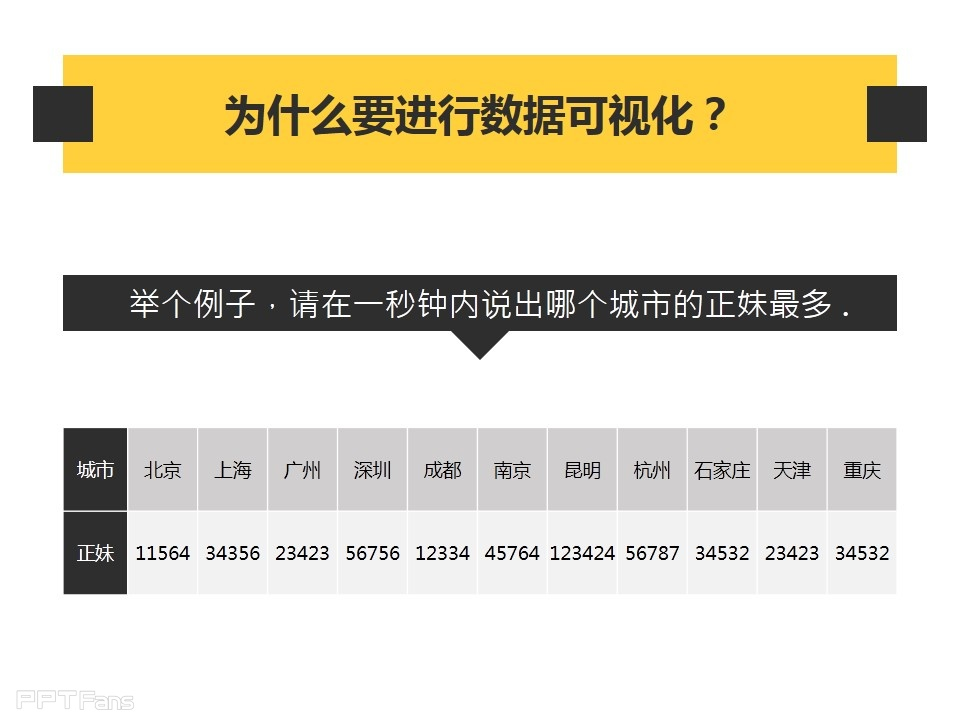

========================================================

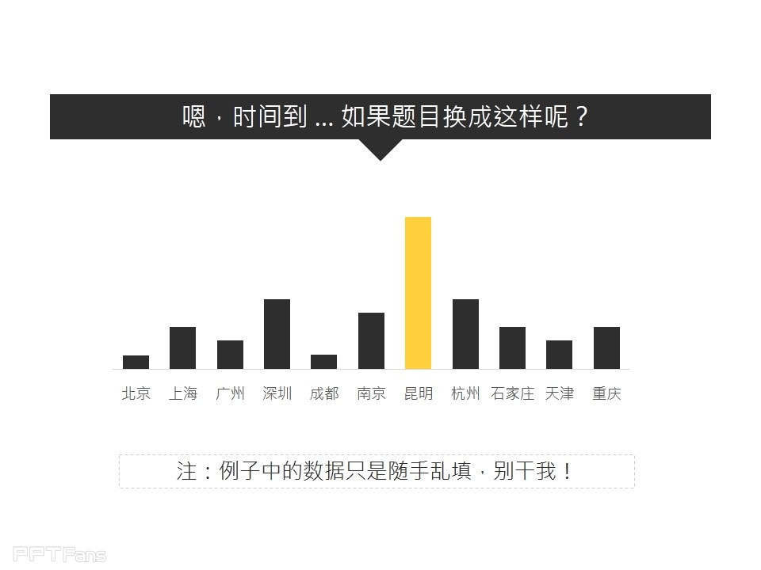

Prejudice Atlas
======================================================

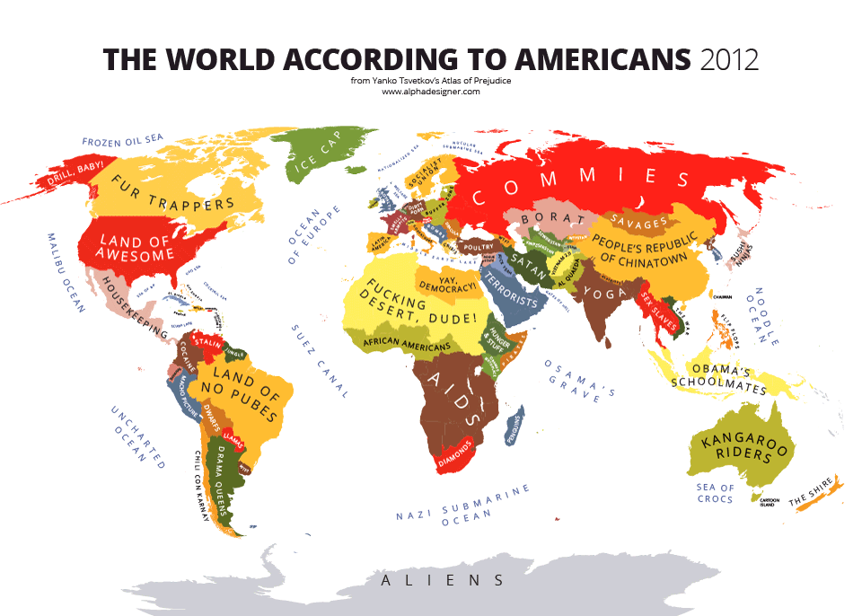</img>

=====================================================

<video controls width="900" height="1000" preload="auto">
  <source src="video.mp4" type="video/mp4">
  <source src="video.ogg" type="video/ogg">
Your browser does not support the video tag.
</video>

googleVis - Motion Chart
=========================

<!-- MotionChart generated in R 3.2.3 by googleVis 0.5.10 package -->
<!-- Sun Jul 31 12:36:23 2016 -->

<!-- jsHeader -->
<script type="text/javascript">
 
// jsData 
function gvisDataMotionChartID14b5512201159 () {
var data = new google.visualization.DataTable();
var datajson =
[
 [
 "Ghana",
1960,
182.9792462,
45.83146341,
6958283 
],
[
 "Ghana",
1961,
189.7132146,
46.26670732,
7153508 
],
[
 "Ghana",
1962,
195.1200161,
46.68253659,
7355248 
],
[
 "Ghana",
1963,
210.9689785,
47.07843902,
7563839 
],
[
 "Ghana",
1964,
230.4312919,
47.45336585,
7781813 
],
[
 "Ghana",
1965,
266.3187149,
47.80763415,
8009602 
],
[
 "Ghana",
1966,
269.4592356,
48.14097561,
8245481 
],
[
 "Ghana",
1967,
216.8414796,
48.4552439,
8490213 
],
[
 "Ghana",
1968,
202.761861,
48.75641463,
8744302 
],
[
 "Ghana",
1969,
233.6512698,
49.04807317,
9009048 
],
[
 "Ghana",
1970,
257.6520315,
49.33497561,
8788945 
],
[
 "Ghana",
1971,
273.8227964,
49.62195122,
9065500 
],
[
 "Ghana",
1972,
232.5398623,
49.91229268,
9354120 
],
[
 "Ghana",
1973,
263.685964,
50.20729268,
9649958 
],
[
 "Ghana",
1974,
301.3666732,
50.5095122,
9905330 
],
[
 "Ghana",
1975,
285.8294666,
50.81395122,
10118240 
],
[
 "Ghana",
1976,
275.8779229,
51.11546341,
10333176 
],
[
 "Ghana",
1977,
312.9993439,
51.40982927,
10538093 
],
[
 "Ghana",
1978,
353.7091805,
51.69729268,
10720559 
],
[
 "Ghana",
1979,
381.0364486,
51.98178049,
10878226 
],
[
 "Ghana",
1980,
411.5180309,
52.27178049,
11015630 
],
[
 "Ghana",
1981,
379.7976753,
52.57831707,
11176529 
],
[
 "Ghana",
1982,
351.3192057,
52.91043902,
11400338 
],
[
 "Ghana",
1983,
341.0870733,
53.27368293,
12150541 
],
[
 "Ghana",
1984,
358.3965861,
53.6704878,
12829647 
],
[
 "Ghana",
1985,
354.2197113,
54.10970732,
13224725 
],
[
 "Ghana",
1986,
437.0889481,
54.60268293,
13776193 
],
[
 "Ghana",
1987,
376.4604229,
55.13731707,
14168101 
],
[
 "Ghana",
1988,
375.225019,
55.69363415,
14568008 
],
[
 "Ghana",
1989,
368.998198,
56.24717073,
14975941 
],
[
 "Ghana",
1990,
402.5888817,
56.75163415,
15399466 
],
[
 "Ghana",
1991,
438.5203726,
57.15726829,
15837581 
],
[
 "Ghana",
1992,
414.5616397,
57.43678049,
16278738 
],
[
 "Ghana",
1993,
375.0653336,
57.57980488,
16784962 
],
[
 "Ghana",
1994,
333.217825,
57.59482927,
17274479 
],
[
 "Ghana",
1995,
385.7252602,
57.50270732,
17669087 
],
[
 "Ghana",
1996,
403.9197548,
57.34078049,
18041282 
],
[
 "Ghana",
1997,
392.2518164,
57.1642439,
18418288 
],
[
 "Ghana",
1998,
416.3262485,
57.02392683,
18819453 
],
[
 "Ghana",
1999,
419.8855509,
56.95370732,
19232823 
],
[
 "Ghana",
2000,
264.7025762,
56.98709756,
19657719 
],
[
 "Ghana",
2001,
275.4723721,
57.14760976,
20093021 
],
[
 "Ghana",
2002,
311.616825,
57.42043902,
20550751 
],
[
 "Ghana",
2003,
375.8807045,
57.78517073,
21019630 
],
[
 "Ghana",
2004,
426.1592342,
58.22236585,
21483085 
],
[
 "Ghana",
2005,
501.7240746,
58.70104878,
21946247 
],
[
 "Ghana",
2006,
929.7266286,
59.18421951,
22409572 
],
[
 "Ghana",
2007,
1099.022313,
59.63585366,
22873338 
],
[
 "Ghana",
2008,
1234.0799,
60.03041463,
23336661 
],
[
 "Uganda",
1960,
62.33536421,
43.98356098,
7261862 
],
[
 "Uganda",
1961,
63.03563877,
44.56002439,
7471533 
],
[
 "Uganda",
1962,
62.03710188,
45.14704878,
7688797 
],
[
 "Uganda",
1963,
68.95777879,
45.73812195,
7913960 
],
[
 "Uganda",
1964,
76.06944471,
46.32126829,
8147346 
],
[
 "Uganda",
1965,
110.3644674,
46.8794878,
8389294 
],
[
 "Uganda",
1966,
111.5892626,
47.3947561,
8640153 
],
[
 "Uganda",
1967,
112.7237116,
47.85353659,
8900294 
],
[
 "Uganda",
1968,
116.9159194,
48.24582927,
9170101 
],
[
 "Uganda",
1969,
127.5330805,
48.56758537,
9449977 
],
[
 "Uganda",
1970,
133.34233,
48.81680488,
9728111 
],
[
 "Uganda",
1971,
145.7961406,
49.0004878,
9983229 
],
[
 "Uganda",
1972,
149.2713647,
49.13312195,
10190285 
],
[
 "Uganda",
1973,
165.9283507,
49.22568293,
10385004 
],
[
 "Uganda",
1974,
199.261376,
49.28714634,
10619695 
],
[
 "Uganda",
1975,
217.9311058,
49.32397561,
10890181 
],
[
 "Uganda",
1976,
219.6903132,
49.34414634,
11169608 
],
[
 "Uganda",
1977,
255.9965907,
49.34612195,
11457758 
],
[
 "Uganda",
1978,
204.7953042,
49.32539024,
11755730 
],
[
 "Uganda",
1979,
175.6513167,
49.27546341,
12032167 
],
[
 "Uganda",
1980,
99.18986298,
49.18278049,
12296592 
],
[
 "Uganda",
1981,
103.4500871,
49.02878049,
12595972 
],
[
 "Uganda",
1982,
163.4986964,
48.8025122,
12939400 
],
[
 "Uganda",
1983,
163.2012564,
48.50204878,
13321200 
],
[
 "Uganda",
1984,
255.28439,
48.13002439,
13761689 
],
[
 "Uganda",
1985,
240.5627634,
47.69060976,
14225933 
],
[
 "Uganda",
1986,
259.2382413,
47.18897561,
14717932 
],
[
 "Uganda",
1987,
400.1410913,
46.64678049,
15283050 
],
[
 "Uganda",
1988,
401.0981449,
46.09312195,
15892811 
],
[
 "Uganda",
1989,
314.0340383,
45.55558537,
16500123 
],
[
 "Uganda",
1990,
247.6017114,
45.05626829,
17074034 
],
[
 "Uganda",
1991,
184.8133287,
44.61221951,
17651716 
],
[
 "Uganda",
1992,
153.8623001,
44.23929268,
18252190 
],
[
 "Uganda",
1993,
167.9265898,
43.95734146,
18903138 
],
[
 "Uganda",
1994,
201.6258306,
43.7942439,
19566609 
],
[
 "Uganda",
1995,
281.9687578,
43.78331707,
20094075 
],
[
 "Uganda",
1996,
287.2701338,
43.95741463,
20623835 
],
[
 "Uganda",
1997,
289.1826002,
44.31887805,
21210254 
],
[
 "Uganda",
1998,
294.7965827,
44.85909756,
21829118 
],
[
 "Uganda",
1999,
260.5085667,
45.56497561,
22535846 
],
[
 "Uganda",
2000,
260.6844737,
46.41997561,
23248553 
],
[
 "Uganda",
2001,
238.0510659,
47.40414634,
23970202 
],
[
 "Uganda",
2002,
243.6746249,
48.47558537,
24739869 
],
[
 "Uganda",
2003,
241.6948011,
49.58780488,
25556448 
],
[
 "Uganda",
2004,
292.843015,
50.7012439,
26390258 
],
[
 "Uganda",
2005,
321.4357614,
51.77021951,
27269482 
],
[
 "Uganda",
2006,
342.837264,
52.75704878,
28195754 
],
[
 "Uganda",
2007,
409.870326,
53.65414634,
29170398 
],
[
 "Uganda",
2008,
459.1097759,
54.46197561,
30214531 
],
[
 "United States",
1960,
3007.123445,
69.77073171,
180671000 
],
[
 "United States",
1961,
3066.562869,
70.27073171,
183691000 
],
[
 "United States",
1962,
3243.843078,
70.1195122,
186538000 
],
[
 "United States",
1963,
3374.515171,
69.91707317,
189242000 
],
[
 "United States",
1964,
3573.941185,
70.16585366,
191889000 
],
[
 "United States",
1965,
3827.52711,
70.21463415,
194303000 
],
[
 "United States",
1966,
4146.316646,
70.21219512,
196560000 
],
[
 "United States",
1967,
4336.426587,
70.56097561,
198712000 
],
[
 "United States",
1968,
4695.92339,
69.95121951,
200706000 
],
[
 "United States",
1969,
5032.144743,
70.50731707,
202677000 
],
[
 "United States",
1970,
5246.883717,
70.80731707,
205052000 
],
[
 "United States",
1971,
5623.443978,
71.10731707,
207661000 
],
[
 "United States",
1972,
6109.925868,
71.15609756,
209896000 
],
[
 "United States",
1973,
6741.332364,
71.35609756,
211909000 
],
[
 "United States",
1974,
7242.441105,
71.95609756,
213854000 
],
[
 "United States",
1975,
7820.065471,
72.60487805,
215973000 
],
[
 "United States",
1976,
8611.401839,
72.85609756,
218035000 
],
[
 "United States",
1977,
9471.306172,
73.25609756,
220239000 
],
[
 "United States",
1978,
10587.28576,
73.35609756,
222585000 
],
[
 "United States",
1979,
11695.55442,
73.80487805,
225055000 
],
[
 "United States",
1980,
12597.66751,
73.6097561,
227726463 
],
[
 "United States",
1981,
13993.16674,
74.0097561,
229966237 
],
[
 "United States",
1982,
14438.97628,
74.36097561,
232187835 
],
[
 "United States",
1983,
15561.4264,
74.46341463,
234307207 
],
[
 "United States",
1984,
17134.28602,
74.56341463,
236348292 
],
[
 "United States",
1985,
18269.42217,
74.56341463,
238466283 
],
[
 "United States",
1986,
19115.05291,
74.61463415,
240650755 
],
[
 "United States",
1987,
20100.85889,
74.76585366,
242803533 
],
[
 "United States",
1988,
21483.23306,
74.76585366,
245021414 
],
[
 "United States",
1989,
22922.43709,
75.01707317,
247341697 
],
[
 "United States",
1990,
23954.47935,
75.21463415,
250131894 
],
[
 "United States",
1991,
24405.16481,
75.36585366,
253492503 
],
[
 "United States",
1992,
25492.95165,
75.61707317,
256894189 
],
[
 "United States",
1993,
26464.85251,
75.4195122,
260255352 
],
[
 "United States",
1994,
27776.63553,
75.6195122,
263435673 
],
[
 "United States",
1995,
28782.17502,
75.62195122,
266557091 
],
[
 "United States",
1996,
30068.23092,
76.02682927,
269667391 
],
[
 "United States",
1997,
31572.69023,
76.42926829,
272911760 
],
[
 "United States",
1998,
32949.19776,
76.5804878,
276115288 
],
[
 "United States",
1999,
34620.9289,
76.58292683,
279294713 
],
[
 "United States",
2000,
36449.85512,
76.63658537,
282338631 
],
[
 "United States",
2001,
37273.6181,
76.83658537,
285023886 
],
[
 "United States",
2002,
38166.03784,
76.93658537,
287675526 
],
[
 "United States",
2003,
39677.19835,
77.03658537,
290342554 
],
[
 "United States",
2004,
41921.80976,
77.48780488,
293027571 
],
[
 "United States",
2005,
44307.92058,
77.48780488,
295734134 
],
[
 "United States",
2006,
46437.06712,
77.68780488,
298444215 
],
[
 "United States",
2007,
48061.53766,
77.98780488,
301139947 
],
[
 "United States",
2008,
48401.42734,
78.03902439,
303824646 
],
[
 "India",
1960,
83.79468367,
41.17195122,
434000000 
],
[
 "India",
1961,
87.03116614,
41.7904878,
444000000 
],
[
 "India",
1962,
91.65791058,
42.41741463,
454000000 
],
[
 "India",
1963,
103.1358714,
43.05273171,
464000000 
],
[
 "India",
1964,
117.8428256,
43.69841463,
474000000 
],
[
 "India",
1965,
121.7047543,
44.3535122,
485000000 
],
[
 "India",
1966,
91.7968817,
45.0185122,
495000000 
],
[
 "India",
1967,
98.26248566,
45.69092683,
506000000 
],
[
 "India",
1968,
101.8649561,
46.3677561,
518000000 
],
[
 "India",
1969,
109.7601903,
47.047,
529000000 
],
[
 "India",
1970,
114.6637038,
47.72707317,
541000000 
],
[
 "India",
1971,
120.952379,
48.40741463,
554000000 
],
[
 "India",
1972,
125.4165516,
49.08697561,
567000000 
],
[
 "India",
1973,
146.6251044,
49.76029268,
580000000 
],
[
 "India",
1974,
166.7167177,
50.42341463,
593000000 
],
[
 "India",
1975,
161.1692578,
51.06792683,
607000000 
],
[
 "India",
1976,
164.2894419,
51.68946341,
620000000 
],
[
 "India",
1977,
189.9161192,
52.28463415,
634000000 
],
[
 "India",
1978,
209.7928295,
52.84902439,
648000000 
],
[
 "India",
1979,
228.476382,
53.38070732,
664000000 
],
[
 "India",
1980,
271.9248895,
53.87470732,
679000000 
],
[
 "India",
1981,
275.9166525,
54.32853659,
692000000 
],
[
 "India",
1982,
279.6568514,
54.74460976,
708000000 
],
[
 "India",
1983,
297.1604966,
55.13234146,
723000000 
],
[
 "India",
1984,
282.3176652,
55.49963415,
739000000 
],
[
 "India",
1985,
302.5106767,
55.86090244,
755000000 
],
[
 "India",
1986,
316.8461137,
56.2305122,
771000000 
],
[
 "India",
1987,
347.425081,
56.61843902,
788000000 
],
[
 "India",
1988,
361.450358,
57.03112195,
805000000 
],
[
 "India",
1989,
353.2554885,
57.47304878,
822000000 
],
[
 "India",
1990,
375.1520193,
57.94373171,
839000000 
],
[
 "India",
1991,
309.3279361,
58.43821951,
856000000 
],
[
 "India",
1992,
323.5247922,
58.94507317,
872000000 
],
[
 "India",
1993,
307.4110432,
59.45292683,
891000000 
],
[
 "India",
1994,
353.2924952,
59.95482927,
908000000 
],
[
 "India",
1995,
381.5274622,
60.44436585,
927000000 
],
[
 "India",
1996,
408.2417747,
60.91560976,
943000000 
],
[
 "India",
1997,
424.0864738,
61.36956098,
959000000 
],
[
 "India",
1998,
421.8215901,
61.80721951,
975000000 
],
[
 "India",
1999,
451.0891442,
62.22707317,
991691000 
],
[
 "India",
2000,
452.4135847,
62.63063415,
1007702000 
],
[
 "India",
2001,
460.8261999,
63.01985366,
1023590000 
],
[
 "India",
2002,
480.6214422,
63.39919512,
1034172547 
],
[
 "India",
2003,
557.8973659,
63.77453659,
1049700118 
],
[
 "India",
2004,
640.6005222,
64.14780488,
1065070607 
],
[
 "India",
2005,
729.000727,
64.52387805,
1080264388 
],
[
 "India",
2006,
816.7337762,
64.90809756,
1095351995 
],
[
 "India",
2007,
1050.024801,
65.30043902,
1110396331 
],
[
 "India",
2008,
1022.577592,
65.69943902,
1125368288 
],
[
 "Switzerland",
1960,
1787.360348,
71.31341463,
5362000 
],
[
 "Switzerland",
1961,
1971.316323,
71.64487805,
5512000 
],
[
 "Switzerland",
1962,
2131.391652,
71.19609756,
5666000 
],
[
 "Switzerland",
1963,
2294.182847,
71.18756098,
5789000 
],
[
 "Switzerland",
1964,
2501.29319,
72.07780488,
5887000 
],
[
 "Switzerland",
1965,
2620.475547,
72.20170732,
5943000 
],
[
 "Switzerland",
1966,
2784.733548,
72.33560976,
5996000 
],
[
 "Switzerland",
1967,
2960.722586,
72.63658537,
6063000 
],
[
 "Switzerland",
1968,
3121.889031,
72.5902439,
6132000 
],
[
 "Switzerland",
1969,
3344.783603,
72.61268293,
6212000 
],
[
 "Switzerland",
1980,
18785.03644,
75.45926829,
6385229 
],
[
 "Switzerland",
1981,
17110.44514,
75.69317073,
6425450 
],
[
 "Switzerland",
1982,
17434.88509,
76.03390244,
6468126 
],
[
 "Switzerland",
1983,
17298.56641,
76.03121951,
6501073 
],
[
 "Switzerland",
1984,
16457.82916,
76.60853659,
6529684 
],
[
 "Switzerland",
1985,
16613.62848,
76.73365854,
6563770 
],
[
 "Switzerland",
1986,
23691.97026,
76.89902439,
6603192 
],
[
 "Switzerland",
1987,
29484.873,
77.19756098,
6649942 
],
[
 "Switzerland",
1988,
31664.15929,
77.22658537,
6704112 
],
[
 "Switzerland",
1989,
30325.75893,
77.42121951,
6763653 
],
[
 "Switzerland",
1990,
38332.15172,
77.24243902,
6836626 
],
[
 "Switzerland",
1991,
38303.04989,
77.51463415,
6920562 
],
[
 "Switzerland",
1992,
39435.53813,
77.80609756,
6995447 
],
[
 "Switzerland",
1993,
38005.32345,
78.08536585,
7058211 
],
[
 "Switzerland",
1994,
41738.97019,
78.35,
7114530 
],
[
 "Switzerland",
1995,
48540.57749,
78.41707317,
7157106 
],
[
 "Switzerland",
1996,
46610.05975,
78.89609756,
7181024 
],
[
 "Switzerland",
1997,
40429.93726,
79.0795122,
7193761 
],
[
 "Switzerland",
1998,
41487.69019,
79.32439024,
7207995 
],
[
 "Switzerland",
1999,
40577.33663,
79.5804878,
7232809 
],
[
 "Switzerland",
2000,
37813.23426,
79.6804878,
7266920 
],
[
 "Switzerland",
2001,
38538.64447,
80.1804878,
7311237 
],
[
 "Switzerland",
2002,
41336.72192,
80.38536585,
7361757 
],
[
 "Switzerland",
2003,
47960.56497,
80.53658537,
7408319 
],
[
 "Switzerland",
2004,
53255.97631,
81.08780488,
7450867 
],
[
 "Switzerland",
2005,
54797.54663,
81.23658537,
7489370 
],
[
 "Switzerland",
2006,
57348.92788,
81.4902439,
7523934 
],
[
 "Switzerland",
2007,
63223.46778,
81.74146341,
7554661 
],
[
 "Switzerland",
2008,
72119.56087,
81.99268293,
7581520 
],
[
 "China",
1960,
88.72249762,
43.354,
667070000 
],
[
 "China",
1961,
75.04891521,
43.67334146,
660330000 
],
[
 "China",
1962,
70.12208196,
44.39834146,
665770000 
],
[
 "China",
1963,
73.42039214,
45.57887805,
682335000 
],
[
 "China",
1964,
84.57339733,
47.18956098,
698355000 
],
[
 "China",
1965,
97.47009951,
49.13931707,
715185000 
],
[
 "China",
1966,
103.1811732,
51.28219512,
735400000 
],
[
 "China",
1967,
95.49669148,
53.42980488,
754550000 
],
[
 "China",
1968,
90.37132883,
55.4275122,
774510000 
],
[
 "China",
1969,
98.88988471,
57.19187805,
796025000 
],
[
 "China",
1970,
111.8227227,
58.68080488,
818315000 
],
[
 "China",
1971,
117.1815931,
59.90797561,
841105000 
],
[
 "China",
1972,
130.1112649,
60.95934146,
862030000 
],
[
 "China",
1973,
155.0784388,
61.90646341,
881940000 
],
[
 "China",
1974,
157.9993803,
62.76812195,
900350000 
],
[
 "China",
1975,
175.8657481,
63.55865854,
916395000 
],
[
 "China",
1976,
162.9205234,
64.28258537,
930685000 
],
[
 "China",
1977,
182.6785743,
64.93653659,
943455000 
],
[
 "China",
1978,
155.1846298,
65.52321951,
956165000 
],
[
 "China",
1979,
182.5135323,
66.04968293,
969005000 
],
[
 "China",
1980,
193.2768322,
66.5215122,
981235000 
],
[
 "China",
1981,
195.5649286,
66.93985366,
993861000 
],
[
 "China",
1982,
201.808024,
67.3077561,
1000281000 
],
[
 "China",
1983,
223.7349393,
67.6287561,
1023288000 
],
[
 "China",
1984,
248.9158221,
67.91036585,
1036825000 
],
[
 "China",
1985,
292.547939,
68.15707317,
1051040000 
],
[
 "China",
1986,
280.0980446,
68.37180488,
1066790000 
],
[
 "China",
1987,
250.3145871,
68.55943902,
1084035000 
],
[
 "China",
1988,
282.0567828,
68.72543902,
1101630000 
],
[
 "China",
1989,
309.2633852,
68.88029268,
1118650000 
],
[
 "China",
1990,
316.2244304,
69.0305122,
1135185000 
],
[
 "China",
1991,
331.474916,
69.18209756,
1150780000 
],
[
 "China",
1992,
364.7596641,
69.33963415,
1164970000 
],
[
 "China",
1993,
375.8142938,
69.50921951,
1178440000 
],
[
 "China",
1994,
471.7608812,
69.69992683,
1191835000 
],
[
 "China",
1995,
607.5685831,
69.92641463,
1204855000 
],
[
 "China",
1996,
707.0297713,
70.19982927,
1217550000 
],
[
 "China",
1997,
778.9439057,
70.52268293,
1230075000 
],
[
 "China",
1998,
825.5479571,
70.89046341,
1241935000 
],
[
 "China",
1999,
869.6548821,
71.29712195,
1252735000 
],
[
 "China",
2000,
954.5522917,
71.73046341,
1262645000 
],
[
 "China",
2001,
1047.477863,
72.17578049,
1271850000 
],
[
 "China",
2002,
1141.757644,
72.61487805,
1280400000 
],
[
 "China",
2003,
1280.602855,
73.03312195,
1288400000 
],
[
 "China",
2004,
1498.173796,
73.41995122,
1295733978 
],
[
 "China",
2005,
1740.096726,
73.76695122,
1303182268 
],
[
 "China",
2006,
2082.183362,
74.07170732,
1310823807 
],
[
 "China",
2007,
2673.294191,
74.34043902,
1318683096 
],
[
 "China",
2008,
3441.221355,
74.58326829,
1326856173 
],
[
 "Chile",
1960,
547.2850266,
57.45829268,
7585349 
],
[
 "Chile",
1961,
597.6228026,
57.98634146,
7773314 
],
[
 "Chile",
1962,
683.2210679,
58.51539024,
7961258 
],
[
 "Chile",
1963,
665.5811901,
59.04643902,
8147349 
],
[
 "Chile",
1964,
687.8650023,
59.57802439,
8330423 
],
[
 "Chile",
1965,
702.942226,
60.11009756,
8509950 
],
[
 "Chile",
1966,
796.7328529,
60.64321951,
8685954 
],
[
 "Chile",
1967,
768.5654125,
61.17539024,
8858908 
],
[
 "Chile",
1968,
770.0407447,
61.70758537,
9029621 
],
[
 "Chile",
1969,
872.3223701,
62.23834146,
9199122 
],
[
 "Chile",
1970,
939.263297,
62.76814634,
9368558 
],
[
 "Chile",
1971,
1097.82711,
63.2965122,
9540298 
],
[
 "Chile",
1972,
1162.955722,
63.82290244,
9717524 
],
[
 "Chile",
1973,
1624.550672,
64.34734146,
9896635 
],
[
 "Chile",
1974,
1514.913472,
64.86980488,
10076544 
],
[
 "Chile",
1975,
693.4805864,
65.38880488,
10251542 
],
[
 "Chile",
1976,
931.3423204,
65.90534146,
10432214 
],
[
 "Chile",
1977,
1243.135837,
66.41790244,
10599793 
],
[
 "Chile",
1978,
1411.768525,
66.9265122,
10759823 
],
[
 "Chile",
1979,
1872.574656,
67.43165854,
10922822 
],
[
 "Chile",
1980,
2454.288156,
67.93134146,
11093718 
],
[
 "Chile",
1981,
2863.462522,
68.42807317,
11282304 
],
[
 "Chile",
1982,
2103.823804,
68.91985366,
11487112 
],
[
 "Chile",
1983,
1683.725609,
69.40765854,
11686845 
],
[
 "Chile",
1984,
1613.294224,
69.891,
11879139 
],
[
 "Chile",
1985,
1361.515363,
70.36939024,
12066701 
],
[
 "Chile",
1986,
1440.364457,
70.84280488,
12259840 
],
[
 "Chile",
1987,
1671.166627,
71.3107561,
12463354 
],
[
 "Chile",
1988,
1937.710621,
71.7732439,
12677524 
],
[
 "Chile",
1989,
2195.54149,
72.2292439,
12901157 
],
[
 "Chile",
1990,
2401.525181,
72.67878049,
13127760 
],
[
 "Chile",
1991,
2727.573825,
73.12134146,
13352503 
],
[
 "Chile",
1992,
3277.669086,
73.55843902,
13572994 
],
[
 "Chile",
1993,
3461.435092,
73.98856098,
13788271 
],
[
 "Chile",
1994,
3942.967594,
74.41270732,
14000060 
],
[
 "Chile",
1995,
5026.720634,
74.83039024,
14205449 
],
[
 "Chile",
1996,
5263.191366,
75.24160976,
14404243 
],
[
 "Chile",
1997,
5674.153008,
75.64636585,
14599929 
],
[
 "Chile",
1998,
5367.211824,
76.04465854,
14790995 
],
[
 "Chile",
1999,
4872.692148,
76.43597561,
14975383 
],
[
 "Chile",
2000,
5229.177098,
76.82082927,
15153450 
],
[
 "Chile",
2001,
4709.9234,
77.19870732,
15327316 
],
[
 "Chile",
2002,
4566.523326,
77.56958537,
15497046 
],
[
 "Chile",
2003,
4948.74818,
77.93297561,
15662645 
],
[
 "Chile",
2004,
6323.75764,
78.28939024,
15823957 
],
[
 "Chile",
2005,
7728.611897,
78.63829268,
15980912 
],
[
 "Chile",
2006,
9500.835162,
78.97917073,
16134219 
],
[
 "Chile",
2007,
10513.54071,
79.31353659,
16284741 
],
[
 "Chile",
2008,
10791.02019,
79.64090244,
16432536 
],
[
 "Sweden",
1960,
1983.106544,
73.00560976,
7480395 
],
[
 "Sweden",
1961,
2147.229311,
73.47439024,
7519998 
],
[
 "Sweden",
1962,
2315.846527,
73.3504878,
7561588 
],
[
 "Sweden",
1963,
2492.545346,
73.55536585,
7604328 
],
[
 "Sweden",
1964,
2758.943466,
73.73317073,
7661354 
],
[
 "Sweden",
1965,
3007.597978,
73.86170732,
7733853 
],
[
 "Sweden",
1966,
3240.611037,
74.07853659,
7807797 
],
[
 "Sweden",
1967,
3490.550337,
74.12243902,
7867931 
],
[
 "Sweden",
1968,
3683.313694,
73.97292683,
7912217 
],
[
 "Sweden",
1969,
3972.002749,
74.08487805,
7968018 
],
[
 "Sweden",
1970,
4669.438672,
74.64926829,
8042803 
],
[
 "Sweden",
1971,
5060.342739,
74.62390244,
8098328 
],
[
 "Sweden",
1972,
5942.148771,
74.71804878,
8122293 
],
[
 "Sweden",
1973,
7198.271657,
74.86731707,
8136774 
],
[
 "Sweden",
1974,
7975.850516,
74.9804878,
8160560 
],
[
 "Sweden",
1975,
9974.657321,
74.98463415,
8192566 
],
[
 "Sweden",
1976,
10715.03809,
74.96926829,
8222310 
],
[
 "Sweden",
1977,
11287.19913,
75.3797561,
8251648 
],
[
 "Sweden",
1978,
12442.57512,
75.46902439,
8275778 
],
[
 "Sweden",
1979,
14667.40312,
75.52414634,
8293723 
],
[
 "Sweden",
1980,
16856.76109,
75.74097561,
8310473 
],
[
 "Sweden",
1981,
15366.66859,
76.02609756,
8320485 
],
[
 "Sweden",
1982,
13545.25912,
76.32731707,
8325260 
],
[
 "Sweden",
1983,
12430.45893,
76.55170732,
8329028 
],
[
 "Sweden",
1984,
12914.33068,
76.81585366,
8342621 
],
[
 "Sweden",
1985,
13474.16135,
76.66780488,
8356337 
],
[
 "Sweden",
1986,
17727.49533,
76.93121951,
8384069 
],
[
 "Sweden",
1987,
21485.29387,
77.09219512,
8421403 
],
[
 "Sweden",
1988,
24188.76594,
76.97926829,
8469339 
],
[
 "Sweden",
1989,
25300.39512,
77.72682927,
8526276 
],
[
 "Sweden",
1990,
30162.31577,
77.53682927,
8600815 
],
[
 "Sweden",
1991,
31374.11699,
77.66682927,
8668112 
],
[
 "Sweden",
1992,
32338.50395,
77.99878049,
8718867 
],
[
 "Sweden",
1993,
24080.89967,
78.0604878,
8769284 
],
[
 "Sweden",
1994,
25747.24169,
78.6502439,
8831493 
],
[
 "Sweden",
1995,
29914.33175,
78.7404878,
8877890 
],
[
 "Sweden",
1996,
32587.2641,
78.95902439,
8892234 
],
[
 "Sweden",
1997,
29897.79263,
79.19756098,
8897619 
],
[
 "Sweden",
1998,
30143.62746,
79.33902439,
8902684 
],
[
 "Sweden",
1999,
30577.08177,
79.44146341,
8909790 
],
[
 "Sweden",
2000,
29283.00505,
79.64390244,
8923569 
],
[
 "Sweden",
2001,
26969.24457,
79.79512195,
8939915 
],
[
 "Sweden",
2002,
29571.70446,
79.84634146,
8954175 
],
[
 "Sweden",
2003,
36961.42537,
80.09512195,
8970306 
],
[
 "Sweden",
2004,
42442.22045,
80.49756098,
8986400 
],
[
 "Sweden",
2005,
43085.35315,
80.54634146,
9001774 
],
[
 "Sweden",
2006,
46256.4716,
80.74878049,
9016596 
],
[
 "Sweden",
2007,
53324.37937,
80.9,
9031088 
],
[
 "Sweden",
2008,
55746.84238,
81.1,
9045389 
],
[
 "Azerbaijan",
1990,
1237.324492,
64.74636585,
7199838 
],
[
 "Azerbaijan",
1991,
1209.237493,
64.42414634,
7308339 
],
[
 "Azerbaijan",
1992,
676.1515115,
64.2072439,
7413618 
],
[
 "Azerbaijan",
1993,
530.0903798,
64.15402439,
7497205 
],
[
 "Azerbaijan",
1994,
436.1905586,
64.28158537,
7572945 
],
[
 "Azerbaijan",
1995,
397.1981161,
64.57582927,
7630291 
],
[
 "Azerbaijan",
1996,
409.2167452,
64.994,
7668253 
],
[
 "Azerbaijan",
1997,
505.5605732,
65.46239024,
7695123 
],
[
 "Azerbaijan",
1998,
561.9103017,
65.92336585,
7714005 
],
[
 "Azerbaijan",
1999,
573.8902562,
66.3554878,
7729131 
],
[
 "Azerbaijan",
2000,
655.0974326,
66.7582439,
7748163 
],
[
 "Azerbaijan",
2001,
703.6712504,
67.15029268,
7771092 
],
[
 "Azerbaijan",
2002,
763.1012122,
67.56107317,
7798497 
],
[
 "Azerbaijan",
2003,
883.614009,
68.00368293,
7830764 
],
[
 "Azerbaijan",
2004,
1045.026415,
68.47019512,
7868385 
],
[
 "Azerbaijan",
2005,
1578.36733,
68.93726829,
7911974 
],
[
 "Azerbaijan",
2006,
2473.085776,
69.3752439,
7961619 
],
[
 "Azerbaijan",
2007,
3851.437869,
69.7565122,
8017309 
],
[
 "Azerbaijan",
2008,
5574.603802,
70.06395122,
8079043 
],
[
 "South Africa",
1960,
423.263749,
49.03629268,
17416653 
],
[
 "South Africa",
1961,
431.3454751,
49.42980488,
17869991 
],
[
 "South Africa",
1962,
447.9928194,
49.81329268,
18356657 
],
[
 "South Africa",
1963,
484.5163244,
50.1957561,
18856708 
],
[
 "South Africa",
1964,
519.3995082,
50.5817561,
19370514 
],
[
 "South Africa",
1965,
554.7791283,
50.97182927,
19898242 
],
[
 "South Africa",
1966,
591.8003045,
51.36302439,
20440487 
],
[
 "South Africa",
1967,
646.2628946,
51.74941463,
20997321 
],
[
 "South Africa",
1968,
684.3103103,
52.126,
21569468 
],
[
 "South Africa",
1969,
754.8990874,
52.49326829,
22157355 
],
[
 "South Africa",
1970,
810.7503056,
52.85068293,
22739921 
],
[
 "South Africa",
1971,
874.4701882,
53.19614634,
23338080 
],
[
 "South Africa",
1972,
897.3870346,
53.53363415,
23935810 
],
[
 "South Africa",
1973,
1202.397493,
53.87056098,
24549294 
],
[
 "South Africa",
1974,
1476.973213,
54.21341463,
25178954 
],
[
 "South Africa",
1975,
1494.17417,
54.57670732,
25815144 
],
[
 "South Africa",
1976,
1403.896196,
54.97446341,
26467896 
],
[
 "South Africa",
1977,
1526.746615,
55.4122439,
27129932 
],
[
 "South Africa",
1978,
1719.826936,
55.89260976,
27809087 
],
[
 "South Africa",
1979,
2076.339777,
56.41404878,
28505816 
],
[
 "South Africa",
1980,
2920.90924,
56.97307317,
29251588 
],
[
 "South Africa",
1981,
3073.263004,
57.56263415,
30168679 
],
[
 "South Africa",
1982,
2764.184855,
58.16719512,
31140029 
],
[
 "South Africa",
1983,
2893.793637,
58.76878049,
32143960 
],
[
 "South Africa",
1984,
2791.9498,
59.35243902,
33181594 
],
[
 "South Africa",
1985,
2142.114701,
59.91217073,
34254092 
],
[
 "South Africa",
1986,
2475.10247,
60.4495122,
35098897 
],
[
 "South Africa",
1987,
3158.667713,
60.95802439,
35933379 
],
[
 "South Africa",
1988,
3398.619067,
61.42380488,
36761065 
],
[
 "South Africa",
1989,
3621.49758,
61.82043902,
37581427 
],
[
 "South Africa",
1990,
3182.23967,
62.12007317,
38391094 
],
[
 "South Africa",
1991,
3345.827626,
62.29480488,
39183648 
],
[
 "South Africa",
1992,
3557.128685,
62.32517073,
39964159 
],
[
 "South Africa",
1993,
3584.099342,
62.19373171,
40639384 
],
[
 "South Africa",
1994,
3650.486114,
61.88797561,
41211897 
],
[
 "South Africa",
1995,
3973.932383,
61.37002439,
41779149 
],
[
 "South Africa",
1996,
3690.178479,
60.60546341,
42311979 
],
[
 "South Africa",
1997,
3728.333992,
59.61319512,
42835005 
],
[
 "South Africa",
1998,
3288.203765,
58.44302439,
43334603 
],
[
 "South Africa",
1999,
3183.149769,
57.15668293,
43745636 
],
[
 "South Africa",
2000,
3099.131614,
55.83687805,
44066197 
],
[
 "South Africa",
2001,
2705.780204,
54.57080488,
44296012 
],
[
 "South Africa",
2002,
2540.971222,
53.44119512,
44433622 
],
[
 "South Africa",
2003,
3807.115746,
52.5237561,
44481901 
],
[
 "South Africa",
2004,
4901.121316,
51.8737561,
44448470 
],
[
 "South Africa",
2005,
5453.192814,
51.55734146,
44344136 
],
[
 "South Africa",
2006,
5668.386771,
51.61370732,
44187637 
],
[
 "South Africa",
2007,
6161.217951,
51.9965122,
43997828 
],
[
 "South Africa",
2008,
5817.27839,
52.63602439,
43786115 
],
[
 "Norway",
1960,
1441.75566,
73.5497561,
3581239 
],
[
 "Norway",
1961,
1560.324931,
73.5504878,
3609800 
],
[
 "Norway",
1962,
1667.24743,
73.44804878,
3638919 
],
[
 "Norway",
1963,
1775.582655,
73.07756098,
3666540 
],
[
 "Norway",
1964,
1937.884614,
73.59585366,
3694339 
],
[
 "Norway",
1965,
2164.468823,
73.72317073,
3723153 
],
[
 "Norway",
1966,
2317.194884,
73.99536585,
3753628 
],
[
 "Norway",
1967,
2514.043772,
74.06658537,
3786019 
],
[
 "Norway",
1968,
2662.117492,
73.94195122,
3818983 
],
[
 "Norway",
1969,
2875.235844,
73.66341463,
3850977 
],
[
 "Norway",
1970,
3306.219476,
74.08804878,
3877386 
],
[
 "Norway",
1971,
3736.348738,
74.17926829,
3903039 
],
[
 "Norway",
1972,
4413.575692,
74.34463415,
3933004 
],
[
 "Norway",
1973,
5689.588807,
74.44219512,
3960613 
],
[
 "Norway",
1974,
6811.527337,
74.75365854,
3985258 
],
[
 "Norway",
1975,
8204.451512,
74.81756098,
4007313 
],
[
 "Norway",
1976,
8927.201627,
75.0395122,
4026152 
],
[
 "Norway",
1977,
10266.12067,
75.38682927,
4043205 
],
[
 "Norway",
1978,
11462.64159,
75.41853659,
4058671 
],
[
 "Norway",
1979,
13046.53722,
75.41390244,
4072517 
],
[
 "Norway",
1980,
15772.24091,
75.67170732,
4085620 
],
[
 "Norway",
1981,
15512.5067,
75.86902439,
4099702 
],
[
 "Norway",
1982,
15224.89391,
76.01097561,
4114787 
],
[
 "Norway",
1983,
14927.51748,
76.06682927,
4128432 
],
[
 "Norway",
1984,
14989.48577,
76.22439024,
4140095 
],
[
 "Norway",
1985,
15753.55277,
75.91682927,
4152419 
],
[
 "Norway",
1986,
18883.2658,
76.24121951,
4166596 
],
[
 "Norway",
1987,
22505.89771,
76.08170732,
4186147 
],
[
 "Norway",
1988,
24207.28147,
76.2204878,
4208729 
],
[
 "Norway",
1989,
24281.09614,
76.5004878,
4226142 
],
[
 "Norway",
1990,
28242.94374,
76.53731707,
4242006 
],
[
 "Norway",
1991,
28596.933,
76.98073171,
4261733 
],
[
 "Norway",
1992,
30523.98506,
77.18439024,
4286357 
],
[
 "Norway",
1993,
27963.66522,
77.15170732,
4311964 
],
[
 "Norway",
1994,
29315.84191,
77.6897561,
4336638 
],
[
 "Norway",
1995,
34875.19739,
77.73658537,
4359101 
],
[
 "Norway",
1996,
37321.44339,
78.1504878,
4381277 
],
[
 "Norway",
1997,
36628.51742,
78.14268293,
4405672 
],
[
 "Norway",
1998,
34788.77856,
78.32926829,
4432718 
],
[
 "Norway",
1999,
36371.39579,
78.28292683,
4463377 
],
[
 "Norway",
2000,
38146.71539,
78.63414634,
4492400 
],
[
 "Norway",
2001,
38549.58934,
78.78536585,
4515195 
],
[
 "Norway",
2002,
43061.15038,
78.98780488,
4535591 
],
[
 "Norway",
2003,
50111.65445,
79.3902439,
4555400 
],
[
 "Norway",
2004,
57570.26916,
79.84146341,
4574560 
],
[
 "Norway",
2005,
66775.3944,
80.04146341,
4593041 
],
[
 "Norway",
2006,
74114.69715,
80.34390244,
4610820 
],
[
 "Norway",
2007,
85128.65759,
80.39512195,
4627926 
],
[
 "Norway",
2008,
96880.50961,
80.59268293,
4644457 
],
[
 "Belgium",
1960,
1273.691659,
69.70195122,
9118700 
],
[
 "Belgium",
1961,
1350.197673,
70.52097561,
9165800 
],
[
 "Belgium",
1962,
1438.523233,
70.2195122,
9218400 
],
[
 "Belgium",
1963,
1535.023729,
70.05146341,
9283100 
],
[
 "Belgium",
1964,
1701.846276,
70.75512195,
9367000 
],
[
 "Belgium",
1965,
1835.594766,
70.62536585,
9448100 
],
[
 "Belgium",
1966,
1957.62608,
70.70634146,
9507800 
],
[
 "Belgium",
1967,
2086.636005,
71.01292683,
9556500 
],
[
 "Belgium",
1968,
2222.361511,
70.69317073,
9589800 
],
[
 "Belgium",
1969,
2458.08182,
70.76487805,
9612700 
],
[
 "Belgium",
1970,
2780.69881,
70.97195122,
9637800 
],
[
 "Belgium",
1971,
3099.433091,
71.0604878,
9672500 
],
[
 "Belgium",
1972,
3852.145363,
71.40512195,
9709100 
],
[
 "Belgium",
1973,
4927.200588,
71.63536585,
9738400 
],
[
 "Belgium",
1974,
5764.49533,
71.98585366,
9767800 
],
[
 "Belgium",
1975,
6737.254619,
71.97121951,
9794800 
],
[
 "Belgium",
1976,
7281.824621,
72.1197561,
9811000 
],
[
 "Belgium",
1977,
8472.062471,
72.77390244,
9821800 
],
[
 "Belgium",
1978,
10344.85691,
72.69804878,
9829700 
],
[
 "Belgium",
1979,
11873.84662,
73.19365854,
9837200 
],
[
 "Belgium",
1980,
12932.87283,
73.20707317,
9846800 
],
[
 "Belgium",
1981,
10679.67399,
73.62170732,
9852400 
],
[
 "Belgium",
1982,
9393.885569,
73.88804878,
9856303 
],
[
 "Belgium",
1983,
8893.594536,
73.86902439,
9855520 
],
[
 "Belgium",
1984,
8502.54663,
74.40487805,
9855300 
],
[
 "Belgium",
1985,
8797.66799,
74.5202439,
9858200 
],
[
 "Belgium",
1986,
12235.1957,
74.73170732,
9861800 
],
[
 "Belgium",
1987,
15216.8854,
75.36585366,
9870200 
],
[
 "Belgium",
1988,
16478.84717,
75.56585366,
9884000 
],
[
 "Belgium",
1989,
16613.53235,
75.63268293,
9937697 
],
[
 "Belgium",
1990,
20710.66393,
76.05195122,
9969310 
],
[
 "Belgium",
1991,
21154.31183,
76.19219512,
10004487 
],
[
 "Belgium",
1992,
23497.74962,
76.35121951,
10045622 
],
[
 "Belgium",
1993,
22403.238,
76.34536585,
10085426 
],
[
 "Belgium",
1994,
24338.16069,
76.69170732,
10122914 
],
[
 "Belgium",
1995,
28565.94615,
76.84073171,
10155459 
],
[
 "Belgium",
1996,
27701.85197,
77.18731707,
10178934 
],
[
 "Belgium",
1997,
25027.77782,
77.37073171,
10199787 
],
[
 "Belgium",
1998,
25541.71829,
77.47317073,
10217030 
],
[
 "Belgium",
1999,
25444.13926,
77.6195122,
10235655 
],
[
 "Belgium",
2000,
23207.40591,
77.72195122,
10263618 
],
[
 "Belgium",
2001,
23121.56635,
77.97317073,
10291679 
],
[
 "Belgium",
2002,
25052.33028,
78.07560976,
10311970 
],
[
 "Belgium",
2003,
30743.95693,
78.12926829,
10330824 
],
[
 "Belgium",
2004,
35589.71295,
78.87804878,
10348276 
],
[
 "Belgium",
2005,
36967.28292,
78.9804878,
10364388 
],
[
 "Belgium",
2006,
38852.36103,
79.3804878,
10379067 
],
[
 "Belgium",
2007,
44403.83131,
79.78292683,
10392226 
],
[
 "Belgium",
2008,
48424.58927,
79.6804878,
10403951 
],
[
 "Japan",
1960,
478.9953402,
67.66609756,
94091638 
],
[
 "Japan",
1961,
563.5867598,
68.31,
94943293 
],
[
 "Japan",
1962,
633.6403152,
68.59487805,
95831757 
],
[
 "Japan",
1963,
717.8669152,
69.65804878,
96811940 
],
[
 "Japan",
1964,
835.6572525,
70.13243902,
97826267 
],
[
 "Japan",
1965,
919.7766882,
70.20195122,
98882534 
],
[
 "Japan",
1966,
1058.503561,
70.98658537,
99790308 
],
[
 "Japan",
1967,
1228.90921,
71.27658537,
100825279 
],
[
 "Japan",
1968,
1450.619652,
71.61121951,
101960672 
],
[
 "Japan",
1969,
1669.0982,
71.83878049,
103171831 
],
[
 "Japan",
1970,
2003.647047,
71.9502439,
104344973 
],
[
 "Japan",
1971,
2234.261666,
72.88292683,
105696786 
],
[
 "Japan",
1972,
2917.658976,
73.50658537,
107188273 
],
[
 "Japan",
1973,
3931.301627,
73.75756098,
108706797 
],
[
 "Japan",
1974,
4281.359928,
74.39390244,
110162302 
],
[
 "Japan",
1975,
4581.574389,
75.05731707,
111573116 
],
[
 "Japan",
1976,
5111.295149,
75.45682927,
112774841 
],
[
 "Japan",
1977,
6230.335688,
75.89829268,
113872473 
],
[
 "Japan",
1978,
8675.013997,
76.03829268,
114912911 
],
[
 "Japan",
1979,
8953.59152,
76.33756098,
115890431 
],
[
 "Japan",
1980,
9307.839295,
76.09170732,
116807309 
],
[
 "Japan",
1981,
10212.37814,
76.41439024,
117648092 
],
[
 "Japan",
1982,
9428.87465,
76.92292683,
118454974 
],
[
 "Japan",
1983,
10213.95828,
76.96146341,
119269949 
],
[
 "Japan",
1984,
10786.78618,
77.36536585,
120034697 
],
[
 "Japan",
1985,
11465.72578,
77.6504878,
120754335 
],
[
 "Japan",
1986,
16882.27395,
78.06463415,
121491913 
],
[
 "Japan",
1987,
20355.60522,
78.48365854,
122091325 
],
[
 "Japan",
1988,
24592.77201,
78.39926829,
122613000 
],
[
 "Japan",
1989,
24505.7673,
78.81804878,
123107500 
],
[
 "Japan",
1990,
25123.63179,
78.83682927,
123537399 
],
[
 "Japan",
1991,
28540.77148,
79.10073171,
123946268 
],
[
 "Japan",
1992,
31013.64715,
79.15390244,
124329269 
],
[
 "Japan",
1993,
35451.29751,
79.29365854,
124668019 
],
[
 "Japan",
1994,
38814.89438,
79.68707317,
125014050 
],
[
 "Japan",
1995,
42522.06659,
79.53634146,
125341354 
],
[
 "Japan",
1996,
37422.86414,
80.2002439,
125645311 
],
[
 "Japan",
1997,
34304.14897,
80.42414634,
125956499 
],
[
 "Japan",
1998,
30969.73803,
80.50146341,
126246096 
],
[
 "Japan",
1999,
35004.06127,
80.57073171,
126494403 
],
[
 "Japan",
2000,
37299.64413,
81.07609756,
126699784 
],
[
 "Japan",
2001,
32716.41867,
81.41707317,
126891645 
],
[
 "Japan",
2002,
31235.58818,
81.56341463,
127065841 
],
[
 "Japan",
2003,
33690.93773,
81.76,
127214499 
],
[
 "Japan",
2004,
36441.50449,
82.0302439,
127333002 
],
[
 "Japan",
2005,
35781.17005,
81.92512195,
127417244 
],
[
 "Japan",
2006,
34075.97895,
82.32195122,
127463611 
],
[
 "Japan",
2007,
34033.70125,
82.50707317,
127467972 
],
[
 "Japan",
2008,
37865.61803,
82.58756098,
127425722 
],
[
 "Ethiopia",
1981,
202.9434642,
43.67017073,
37056244 
],
[
 "Ethiopia",
1982,
207.7008446,
43.70787805,
38111756 
],
[
 "Ethiopia",
1983,
223.9422521,
43.882,
39204501 
],
[
 "Ethiopia",
1984,
205.0033994,
44.196,
40072430 
],
[
 "Ethiopia",
1985,
232.5103291,
44.62990244,
40698078 
],
[
 "Ethiopia",
1986,
233.9495665,
45.14368293,
41662199 
],
[
 "Ethiopia",
1987,
242.173582,
45.67841463,
42999530 
],
[
 "Ethiopia",
1988,
242.9136122,
46.19212195,
44606289 
],
[
 "Ethiopia",
1989,
247.1611913,
46.66631707,
46396556 
],
[
 "Ethiopia",
1990,
253.3479607,
47.09956098,
48197268 
],
[
 "Ethiopia",
1991,
270.4403309,
47.50536585,
50274862 
],
[
 "Ethiopia",
1992,
203.3416396,
47.9132439,
52088559 
],
[
 "Ethiopia",
1993,
165.1281267,
48.34770732,
53446251 
],
[
 "Ethiopia",
1994,
125.1288855,
48.81329268,
54954863 
],
[
 "Ethiopia",
1995,
133.8986024,
49.3055122,
56628083 
],
[
 "Ethiopia",
1996,
144.692935,
49.80995122,
58283759 
],
[
 "Ethiopia",
1997,
141.0535555,
50.31804878,
59861301 
],
[
 "Ethiopia",
1998,
124.6775752,
50.83029268,
61436985 
],
[
 "Ethiopia",
1999,
119.2999888,
51.35758537,
63054968 
],
[
 "Ethiopia",
2000,
124.0509505,
51.93034146,
64690052 
],
[
 "Ethiopia",
2001,
120.3531152,
52.58692683,
66308836 
],
[
 "Ethiopia",
2002,
111.5311693,
53.3482439,
67946797 
],
[
 "Ethiopia",
2003,
119.0586588,
54.21921951,
69628079 
],
[
 "Ethiopia",
2004,
135.9763619,
55.18982927,
71336571 
],
[
 "Ethiopia",
2005,
161.8769539,
56.23656098,
73053286 
],
[
 "Ethiopia",
2006,
194.0779937,
57.32492683,
74777981 
],
[
 "Ethiopia",
2007,
243.6288455,
58.408,
76511887 
],
[
 "Ethiopia",
2008,
325.7949007,
59.44692683,
78254090 
],
[
 "Australia",
1960,
1806.804876,
70.81707317,
10361273 
],
[
 "Australia",
1961,
1873.450092,
70.97317073,
10598814 
],
[
 "Australia",
1962,
1851.007782,
70.94243902,
10794968 
],
[
 "Australia",
1963,
1963.229966,
70.91170732,
11001483 
],
[
 "Australia",
1964,
2127.165739,
70.88097561,
11218304 
],
[
 "Australia",
1965,
2276.574953,
70.8502439,
11439384 
],
[
 "Australia",
1966,
2338.900693,
70.8195122,
11655083 
],
[
 "Australia",
1967,
2574.67089,
70.86926829,
11872264 
],
[
 "Australia",
1968,
2718.124172,
70.91902439,
12101660 
],
[
 "Australia",
1969,
2985.122962,
70.96878049,
12379384 
],
[
 "Australia",
1970,
3297.783659,
71.01853659,
12660160 
],
[
 "Australia",
1971,
3487.614924,
71.06829268,
12937200 
],
[
 "Australia",
1972,
3940.861981,
71.45756098,
13177000 
],
[
 "Australia",
1973,
4759.98962,
71.84682927,
13380400 
],
[
 "Australia",
1974,
6469.083983,
72.23609756,
13599100 
],
[
 "Australia",
1975,
6987.820995,
72.62536585,
13771400 
],
[
 "Australia",
1976,
7469.203191,
73.01463415,
13915500 
],
[
 "Australia",
1977,
7757.715574,
73.34439024,
14074100 
],
[
 "Australia",
1978,
8233.591804,
73.67414634,
14248600 
],
[
 "Australia",
1979,
9272.757382,
74.00390244,
14421900 
],
[
 "Australia",
1980,
10186.12824,
74.33365854,
14615900 
],
[
 "Australia",
1981,
11826.0429,
74.66341463,
14923260 
],
[
 "Australia",
1982,
12758.67103,
74.90487805,
15184200 
],
[
 "Australia",
1983,
11510.14325,
75.14634146,
15393500 
],
[
 "Australia",
1984,
12429.09098,
75.38780488,
15579400 
],
[
 "Australia",
1985,
11434.35444,
75.62926829,
15788300 
],
[
 "Australia",
1986,
11361.27002,
75.87073171,
16018350 
],
[
 "Australia",
1987,
11625.55676,
76.15170732,
16257249 
],
[
 "Australia",
1988,
14261.33519,
76.43268293,
16520206 
],
[
 "Australia",
1989,
17810.95361,
76.71365854,
16780235 
],
[
 "Australia",
1990,
18221.69121,
76.99463415,
17022133 
],
[
 "Australia",
1991,
18836.78058,
77.27560976,
17257526 
],
[
 "Australia",
1992,
18591.22052,
77.37804878,
17481977 
],
[
 "Australia",
1993,
17657.24424,
77.87804878,
17688687 
],
[
 "Australia",
1994,
18079.26394,
77.87804878,
17892557 
],
[
 "Australia",
1995,
20360.18221,
77.82926829,
18116171 
],
[
 "Australia",
1996,
21917.71922,
78.07804878,
18348078 
],
[
 "Australia",
1997,
23522.77877,
78.4804878,
18565243 
],
[
 "Australia",
1998,
21340.06211,
78.63170732,
18768789 
],
[
 "Australia",
1999,
20536.41231,
78.93170732,
18968247 
],
[
 "Australia",
2000,
21665.11545,
79.23414634,
19164620 
],
[
 "Australia",
2001,
19495.14593,
79.63414634,
19357594 
],
[
 "Australia",
2002,
20059.45207,
79.93658537,
19546792 
],
[
 "Australia",
2003,
23440.00532,
80.23902439,
19731984 
],
[
 "Australia",
2004,
30440.85488,
80.4902439,
19913144 
],
[
 "Australia",
2005,
33982.95043,
80.84146341,
20090437 
],
[
 "Australia",
2006,
36084.85898,
81.04146341,
20264082 
],
[
 "Australia",
2007,
40957.83044,
81.29268293,
20434176 
],
[
 "Australia",
2008,
49628.11513,
81.39512195,
20600856 
],
[
 "Denmark",
1960,
1364.51716,
72.17658537,
4581000 
],
[
 "Denmark",
1961,
1503.537013,
72.43829268,
4609817 
],
[
 "Denmark",
1962,
1681.029913,
72.3197561,
4646899 
],
[
 "Denmark",
1963,
1775.370385,
72.4004878,
4683579 
],
[
 "Denmark",
1964,
2013.243077,
72.48512195,
4720171 
],
[
 "Denmark",
1965,
2243.931595,
72.37073171,
4758100 
],
[
 "Denmark",
1966,
2443.259791,
72.44414634,
4797500 
],
[
 "Denmark",
1967,
2644.786647,
72.92219512,
4838800 
],
[
 "Denmark",
1968,
2712.6124,
73.12146341,
4867300 
],
[
 "Denmark",
1969,
3068.236741,
73.22097561,
4890687 
],
[
 "Denmark",
1970,
3421.989912,
73.34341463,
4928757 
],
[
 "Denmark",
1971,
3792.599722,
73.41463415,
4963126 
],
[
 "Denmark",
1972,
4601.006193,
73.43902439,
4991596 
],
[
 "Denmark",
1973,
6065.39676,
73.68219512,
5021861 
],
[
 "Denmark",
1974,
6719.240665,
73.80829268,
5045297 
],
[
 "Denmark",
1975,
7954.974162,
74.07512195,
5059861 
],
[
 "Denmark",
1976,
8753.249763,
73.7397561,
5072596 
],
[
 "Denmark",
1977,
9760.677372,
74.63243902,
5088419 
],
[
 "Denmark",
1978,
11810.03304,
74.39292683,
5104247 
],
[
 "Denmark",
1979,
13740.96719,
74.21926829,
5116800 
],
[
 "Denmark",
1980,
13833.12352,
74.10170732,
5123027 
],
[
 "Denmark",
1981,
11984.01376,
74.2304878,
5121572 
],
[
 "Denmark",
1982,
11707.41026,
74.55121951,
5117810 
],
[
 "Denmark",
1983,
11768.65525,
74.4204878,
5114297 
],
[
 "Denmark",
1984,
11478.44293,
74.56219512,
5111619 
],
[
 "Denmark",
1985,
12167.45435,
74.42756098,
5113691 
],
[
 "Denmark",
1986,
17146.70436,
74.5797561,
5120534 
],
[
 "Denmark",
1987,
21289.16349,
74.69121951,
5127024 
],
[
 "Denmark",
1988,
22441.08739,
74.77170732,
5129516 
],
[
 "Denmark",
1989,
21799.27814,
74.7997561,
5132593 
],
[
 "Denmark",
1990,
26861.79959,
74.80536585,
5140954 
],
[
 "Denmark",
1991,
26960.9771,
75.15780488,
5154352 
],
[
 "Denmark",
1992,
29526.1666,
75.19414634,
5171393 
],
[
 "Denmark",
1993,
27553.12203,
75.11682927,
5188386 
],
[
 "Denmark",
1994,
29992.22147,
75.37512195,
5205603 
],
[
 "Denmark",
1995,
35351.38071,
75.21268293,
5232612 
],
[
 "Denmark",
1996,
35650.72434,
75.59146341,
5262075 
],
[
 "Denmark",
1997,
32835.92877,
75.94512195,
5283663 
],
[
 "Denmark",
1998,
33368.15485,
76.13902439,
5302767 
],
[
 "Denmark",
1999,
33440.80162,
76.34146341,
5320134 
],
[
 "Denmark",
2000,
30743.55917,
76.59268293,
5337416 
],
[
 "Denmark",
2001,
30751.64946,
76.79268293,
5355826 
],
[
 "Denmark",
2002,
33228.69291,
76.89512195,
5374693 
],
[
 "Denmark",
2003,
40458.77064,
77.14390244,
5394138 
],
[
 "Denmark",
2004,
46487.51491,
77.49268293,
5413392 
],
[
 "Denmark",
2005,
48816.83586,
77.84390244,
5432335 
],
[
 "Denmark",
2006,
52041.00297,
78.09512195,
5450661 
],
[
 "Denmark",
2007,
58501.13832,
78.19512195,
5468120 
],
[
 "Denmark",
2008,
64181.99467,
78.44634146,
5484723 
],
[
 "Rwanda",
1960,
40.56693615,
42.24929268,
3031804 
],
[
 "Rwanda",
1961,
40.71972985,
42.5487561,
3045908 
],
[
 "Rwanda",
1962,
40.97560219,
42.83770732,
3051242 
],
[
 "Rwanda",
1963,
41.25082828,
43.11312195,
3129004 
],
[
 "Rwanda",
1964,
41.11687159,
43.37053659,
3183993 
],
[
 "Rwanda",
1965,
46.02625419,
43.60141463,
3264640 
],
[
 "Rwanda",
1966,
37.51817237,
43.79726829,
3358202 
],
[
 "Rwanda",
1967,
46.67800115,
43.95960976,
3451079 
],
[
 "Rwanda",
1968,
48.81976893,
44.09146341,
3547932 
],
[
 "Rwanda",
1969,
51.83225394,
44.19982927,
3656796 
],
[
 "Rwanda",
1970,
58.56900041,
44.29078049,
3769171 
],
[
 "Rwanda",
1971,
57.63511369,
44.36736585,
3880225 
],
[
 "Rwanda",
1972,
61.8664572,
44.44360976,
3992121 
],
[
 "Rwanda",
1973,
70.87331645,
44.5394878,
4109838 
],
[
 "Rwanda",
1974,
72.97619392,
44.67495122,
4226380 
],
[
 "Rwanda",
1975,
131.1864478,
44.8994878,
4356863 
],
[
 "Rwanda",
1976,
141.731898,
45.26709756,
4502352 
],
[
 "Rwanda",
1977,
160.6366968,
45.78617073,
4657072 
],
[
 "Rwanda",
1978,
188.517566,
46.43656098,
4818992 
],
[
 "Rwanda",
1979,
223.2701133,
47.17509756,
4975833 
],
[
 "Rwanda",
1980,
244.080505,
47.98839024,
5138689 
],
[
 "Rwanda",
1981,
264.7886501,
48.8664878,
5310271 
],
[
 "Rwanda",
1982,
256.4951847,
49.71926829,
5507565 
],
[
 "Rwanda",
1983,
261.0023058,
50.40839024,
5701104 
],
[
 "Rwanda",
1984,
270.0804708,
50.78063415,
5860320 
],
[
 "Rwanda",
1985,
280.4243006,
50.45185366,
6009833 
],
[
 "Rwanda",
1986,
303.3588912,
48.98963415,
6166230 
],
[
 "Rwanda",
1987,
319.9804028,
46.30509756,
6349365 
],
[
 "Rwanda",
1988,
339.8790017,
42.54792683,
6552179 
],
[
 "Rwanda",
1989,
332.2268769,
38.04180488,
6745103 
],
[
 "Rwanda",
1990,
351.2778271,
33.48512195,
6923738 
],
[
 "Rwanda",
1991,
270.3286654,
29.74582927,
7110348 
],
[
 "Rwanda",
1992,
302.2568044,
27.48365854,
7290203 
],
[
 "Rwanda",
1993,
312.9228082,
27.07890244,
7456502 
],
[
 "Rwanda",
1994,
125.6901275,
28.56812195,
6417511 
],
[
 "Rwanda",
1995,
218.7703012,
31.6345122,
5706501 
],
[
 "Rwanda",
1996,
226.6981976,
35.65919512,
6002451 
],
[
 "Rwanda",
1997,
284.5872453,
39.80480488,
7212583 
],
[
 "Rwanda",
1998,
282.2886646,
43.41519512,
7197680 
],
[
 "Rwanda",
1999,
239.633609,
46.22607317,
7358932 
],
[
 "Rwanda",
2000,
216.2758944,
48.19236585,
7507056 
],
[
 "Rwanda",
2001,
201.0640419,
49.50768293,
7673062 
],
[
 "Rwanda",
2002,
196.4447015,
50.60480488,
7852401 
],
[
 "Rwanda",
2003,
212.5120519,
51.81207317,
8042082 
],
[
 "Rwanda",
2004,
236.6292142,
53.19763415,
8238673 
],
[
 "Rwanda",
2005,
286.5674694,
54.75160976,
8440820 
],
[
 "Rwanda",
2006,
336.942281,
56.38665854,
8648248 
],
[
 "Rwanda",
2007,
398.2084859,
57.946,
8860588 
],
[
 "Rwanda",
2008,
491.9404166,
59.31534146,
9077425 
],
[
 "Luxembourg",
1960,
2242.015817,
68.44639024,
313969 
],
[
 "Luxembourg",
1961,
2222.366366,
68.73773171,
316845 
],
[
 "Luxembourg",
1962,
2311.798849,
68.99812195,
320750 
],
[
 "Luxembourg",
1963,
2441.038555,
69.22307317,
324100 
],
[
 "Luxembourg",
1964,
2755.633117,
69.41104878,
327750 
],
[
 "Luxembourg",
1965,
2780.092719,
69.56102439,
331500 
],
[
 "Luxembourg",
1966,
2900.433218,
69.67446341,
333895 
],
[
 "Luxembourg",
1967,
2909.660629,
69.76134146,
335012 
],
[
 "Luxembourg",
1968,
3175.367369,
69.83514634,
335867 
],
[
 "Luxembourg",
1969,
3658.900683,
69.90485366,
337500 
],
[
 "Luxembourg",
1970,
4493.890508,
69.98346341,
339174 
],
[
 "Luxembourg",
1971,
4637.515175,
70.08143902,
342400 
],
[
 "Luxembourg",
1972,
5736.745709,
70.20531707,
346600 
],
[
 "Luxembourg",
1973,
7786.575022,
70.35817073,
350450 
],
[
 "Luxembourg",
1974,
9375.333322,
70.54256098,
355050 
],
[
 "Luxembourg",
1975,
9097.813915,
70.75760976,
358950 
],
[
 "Luxembourg",
1976,
9923.169853,
70.9985122,
360750 
],
[
 "Luxembourg",
1977,
10964.18714,
71.25629268,
361450 
],
[
 "Luxembourg",
1978,
13628.35068,
71.52246341,
362100 
],
[
 "Luxembourg",
1979,
15897.17667,
71.79446341,
363000 
],
[
 "Luxembourg",
1980,
17284.42187,
72.07260976,
364400 
],
[
 "Luxembourg",
1981,
14467.67334,
72.35768293,
365400 
],
[
 "Luxembourg",
1982,
13164.73444,
72.65346341,
365718 
],
[
 "Luxembourg",
1983,
12937.9029,
72.95887805,
365885 
],
[
 "Luxembourg",
1984,
12679.55158,
73.27192683,
366272 
],
[
 "Luxembourg",
1985,
13050.75622,
73.5857561,
367169 
],
[
 "Luxembourg",
1986,
18976.94034,
73.89460976,
369019 
],
[
 "Luxembourg",
1987,
23466.15374,
74.1937561,
371660 
],
[
 "Luxembourg",
1988,
26368.57512,
74.48034146,
375624 
],
[
 "Luxembourg",
1989,
27831.02776,
74.75241463,
377621 
],
[
 "Luxembourg",
1990,
34990.46359,
75.01041463,
382966 
],
[
 "Luxembourg",
1991,
37376.30523,
75.46341463,
387152 
],
[
 "Luxembourg",
1992,
41374.06458,
75.77073171,
392552 
],
[
 "Luxembourg",
1993,
41892.52434,
75.71219512,
398084 
],
[
 "Luxembourg",
1994,
45935.22658,
76.37073171,
403756 
],
[
 "Luxembourg",
1995,
53357.84048,
76.51219512,
409704 
],
[
 "Luxembourg",
1996,
52396.59401,
76.5195122,
415566 
],
[
 "Luxembourg",
1997,
46552.40315,
76.8804878,
421014 
],
[
 "Luxembourg",
1998,
48055.68205,
77.01707317,
426495 
],
[
 "Luxembourg",
1999,
51903.92968,
77.77073171,
432527 
],
[
 "Luxembourg",
2000,
48992.31147,
77.87317073,
438777 
],
[
 "Luxembourg",
2001,
47680.38172,
77.82439024,
444779 
],
[
 "Luxembourg",
2002,
52240.89813,
77.96585366,
450786 
],
[
 "Luxembourg",
2003,
64669.93972,
77.72682927,
456764 
],
[
 "Luxembourg",
2004,
74970.92158,
79.12195122,
462690 
],
[
 "Luxembourg",
2005,
79494.20627,
79.43170732,
468571 
],
[
 "Luxembourg",
2006,
88680.23803,
79.28780488,
474413 
],
[
 "Luxembourg",
2007,
104841.4436,
79.38292683,
480222 
],
[
 "Luxembourg",
2008,
112851.4601,
80.53902439,
486006 
],
[
 "Bolivia",
1960,
152.4617632,
42.11831707,
3434073 
],
[
 "Bolivia",
1961,
162.695619,
42.43343902,
3512782 
],
[
 "Bolivia",
1962,
174.4934315,
42.75704878,
3593918 
],
[
 "Bolivia",
1963,
184.2754408,
43.08914634,
3677637 
],
[
 "Bolivia",
1964,
203.6012515,
43.43021951,
3764067 
],
[
 "Bolivia",
1965,
223.2783299,
43.77978049,
3853315 
],
[
 "Bolivia",
1966,
239.375089,
44.13780488,
3945474 
],
[
 "Bolivia",
1967,
255.8479061,
44.50480488,
4040665 
],
[
 "Bolivia",
1968,
210.1897929,
44.8797561,
4139069 
],
[
 "Bolivia",
1969,
218.5560983,
45.26368293,
4240872 
],
[
 "Bolivia",
1970,
225.748499,
45.65556098,
4346218 
],
[
 "Bolivia",
1971,
238.1114415,
46.05539024,
4454684 
],
[
 "Bolivia",
1972,
267.6865801,
46.46321951,
4565872 
],
[
 "Bolivia",
1973,
263.2105572,
46.8785122,
4679923 
],
[
 "Bolivia",
1974,
428.4324268,
47.30229268,
4796240 
],
[
 "Bolivia",
1975,
480.0505726,
47.73302439,
4914316 
],
[
 "Bolivia",
1976,
533.6275535,
48.17173171,
4955744 
],
[
 "Bolivia",
1977,
616.667074,
48.61890244,
5079716 
],
[
 "Bolivia",
1978,
702.4291799,
49.07302439,
5204622 
],
[
 "Bolivia",
1979,
808.4191206,
49.53460976,
5326981 
],
[
 "Bolivia",
1980,
811.7773315,
50.00414634,
5441298 
],
[
 "Bolivia",
1981,
1031.516342,
50.48214634,
5545224 
],
[
 "Bolivia",
1982,
958.6872467,
50.96809756,
5642224 
],
[
 "Bolivia",
1983,
909.8474557,
51.46153659,
5737434 
],
[
 "Bolivia",
1984,
1013.800438,
51.96292683,
5834293 
],
[
 "Bolivia",
1985,
865.69025,
52.47080488,
5934935 
],
[
 "Bolivia",
1986,
624.71542,
52.98565854,
6041350 
],
[
 "Bolivia",
1987,
672.5651749,
53.50797561,
6156369 
],
[
 "Bolivia",
1988,
697.3705601,
54.03526829,
6283164 
],
[
 "Bolivia",
1989,
701.4646141,
54.56904878,
6423135 
],
[
 "Bolivia",
1990,
709.9486541,
55.10729268,
6573900 
],
[
 "Bolivia",
1991,
764.1413321,
55.65002439,
6731484 
],
[
 "Bolivia",
1992,
791.381317,
56.1982439,
6893451 
],
[
 "Bolivia",
1993,
788.3991365,
56.74943902,
7055495 
],
[
 "Bolivia",
1994,
806.2211259,
57.30512195,
7216538 
],
[
 "Bolivia",
1995,
887.4682897,
57.86329268,
7376582 
],
[
 "Bolivia",
1996,
958.4735178,
58.42495122,
7535615 
],
[
 "Bolivia",
1997,
1006.964099,
58.98860976,
7693188 
],
[
 "Bolivia",
1998,
1058.718354,
59.55426829,
7848703 
],
[
 "Bolivia",
1999,
1012.510021,
60.12141463,
8001930 
],
[
 "Bolivia",
2000,
1007.002869,
60.69004878,
8152620 
],
[
 "Bolivia",
2001,
958.2363141,
61.25919512,
8300463 
],
[
 "Bolivia",
2002,
913.5758534,
61.82882927,
8445134 
],
[
 "Bolivia",
2003,
917.3643105,
62.39897561,
8586443 
],
[
 "Bolivia",
2004,
978.3347576,
62.96863415,
8724156 
],
[
 "Bolivia",
2005,
1046.427843,
63.53978049,
8857870 
],
[
 "Bolivia",
2006,
1233.592974,
64.11495122,
8989046 
],
[
 "Bolivia",
2007,
1389.63175,
64.69412195,
9119152 
],
[
 "Bolivia",
2008,
1736.924014,
65.27380488,
9247816 
],
[
 "Afghanistan",
1960,
59.78768071,
32.3285122,
9829450 
],
[
 "Afghanistan",
1961,
59.89003694,
32.77743902,
10043473 
],
[
 "Afghanistan",
1962,
58.50599501,
33.21990244,
10267083 
],
[
 "Afghanistan",
1963,
78.80258686,
33.65787805,
10500711 
],
[
 "Afghanistan",
1964,
82.23139456,
34.09287805,
10744167 
],
[
 "Afghanistan",
1965,
101.3216271,
34.52539024,
10997885 
],
[
 "Afghanistan",
1966,
137.9467829,
34.95741463,
11262324 
],
[
 "Afghanistan",
1967,
161.3847018,
35.38941463,
11537966 
],
[
 "Afghanistan",
1968,
129.5623184,
35.82241463,
11825320 
],
[
 "Afghanistan",
1969,
129.8573782,
36.26039024,
12122740 
],
[
 "Afghanistan",
1970,
157.2584608,
36.70282927,
12430623 
],
[
 "Afghanistan",
1971,
160.4431518,
37.1527561,
12749385 
],
[
 "Afghanistan",
1972,
136.1756113,
37.61014634,
13079460 
],
[
 "Afghanistan",
1973,
144.1739444,
38.07853659,
13421301 
],
[
 "Afghanistan",
1974,
175.0270977,
38.56090244,
13772076 
],
[
 "Afghanistan",
1975,
188.0851361,
39.05929268,
14132019 
],
[
 "Afghanistan",
1976,
199.1648093,
39.57570732,
14501369 
],
[
 "Afghanistan",
1977,
226.1964267,
40.11014634,
14880372 
],
[
 "Afghanistan",
1978,
249.5737098,
40.66760976,
15269281 
],
[
 "Afghanistan",
1979,
278.3906252,
41.25058537,
15555612 
],
[
 "Afghanistan",
1980,
275.6498281,
41.86753659,
15112149 
],
[
 "Afghanistan",
1981,
267.6624236,
42.52692683,
13812973 
],
[
 "Afghanistan",
2001,
119.8990371,
55.48753659,
23997412 
],
[
 "Afghanistan",
2002,
192.1535283,
55.85719512,
25268405 
],
[
 "Afghanistan",
2003,
203.6510409,
56.23529268,
27060359 
],
[
 "Afghanistan",
2004,
224.9147122,
56.62631707,
28513677 
],
[
 "Afghanistan",
2005,
257.1757947,
57.0272439,
29928987 
],
[
 "Afghanistan",
2006,
280.2456441,
57.43256098,
31056997 
],
[
 "Afghanistan",
2007,
380.4009552,
57.83382927,
31889923 
],
[
 "Afghanistan",
2008,
384.1316813,
58.22502439,
32738376 
],
[
 "Germany",
1970,
2750.719742,
70.63978049,
77783164 
],
[
 "Germany",
1971,
3180.055927,
70.74287805,
78354709 
],
[
 "Germany",
1972,
3795.566081,
70.867,
78717088 
],
[
 "Germany",
1973,
5027.660309,
71.01668293,
78950220 
],
[
 "Germany",
1974,
5617.741721,
71.19541463,
78966137 
],
[
 "Germany",
1975,
6212.763127,
71.40173171,
78682325 
],
[
 "Germany",
1976,
6609.753392,
71.63414634,
78298957 
],
[
 "Germany",
1977,
7653.884711,
71.88368293,
78160773 
],
[
 "Germany",
1978,
9446.166785,
72.14280488,
78066074 
],
[
 "Germany",
1979,
11238.34067,
72.40853659,
78081292 
],
[
 "Germany",
1980,
12092.38185,
72.67790244,
78297904 
],
[
 "Germany",
1981,
10170.44628,
72.95239024,
78401830 
],
[
 "Germany",
1982,
9876.228232,
73.23097561,
78335266 
],
[
 "Germany",
1983,
9827.022409,
73.51214634,
78121655 
],
[
 "Germany",
1984,
9277.932299,
73.79285366,
77855422 
],
[
 "Germany",
1985,
9393.89169,
74.06453659,
77684907 
],
[
 "Germany",
1986,
13410.8971,
74.32163415,
77713485 
],
[
 "Germany",
1987,
16614.4101,
74.55960976,
77718298 
],
[
 "Germany",
1988,
17863.4379,
74.77895122,
78030572 
],
[
 "Germany",
1989,
17697.16351,
74.98268293,
78644914 
],
[
 "Germany",
1990,
22219.57253,
75.17736585,
79380394 
],
[
 "Germany",
1991,
23269.3818,
75.3195122,
79984244 
],
[
 "Germany",
1992,
26333.53744,
75.8195122,
80597764 
],
[
 "Germany",
1993,
25488.51952,
75.87073171,
81132272 
],
[
 "Germany",
1994,
27087.55845,
76.27073171,
81414164 
],
[
 "Germany",
1995,
31729.69976,
76.42195122,
81653702 
],
[
 "Germany",
1996,
30564.24781,
76.67317073,
81890667 
],
[
 "Germany",
1997,
27045.71913,
77.07317073,
82011073 
],
[
 "Germany",
1998,
27340.67288,
77.47560976,
82023672 
],
[
 "Germany",
1999,
26795.99113,
77.72682927,
82074778 
],
[
 "Germany",
2000,
23718.7467,
77.92682927,
82187909 
],
[
 "Germany",
2001,
23687.31689,
78.32926829,
82280551 
],
[
 "Germany",
2002,
25205.16445,
78.22926829,
82350671 
],
[
 "Germany",
2003,
30359.95215,
78.3804878,
82398326 
],
[
 "Germany",
2004,
34165.93403,
78.6804878,
82424609 
],
[
 "Germany",
2005,
34696.62092,
78.93170732,
82431390 
],
[
 "Germany",
2006,
36447.87232,
79.13170732,
82422299 
],
[
 "Germany",
2007,
41814.8191,
79.53414634,
82400996 
],
[
 "Germany",
2008,
45699.19832,
79.73658537,
82369548 
],
[
 "Niger",
1960,
132.4002367,
35.51504878,
3912663 
],
[
 "Niger",
1961,
139.0486106,
35.59426829,
3992502 
],
[
 "Niger",
1962,
147.8437074,
35.66546341,
4076008 
],
[
 "Niger",
1963,
158.322902,
35.72963415,
4162926 
],
[
 "Niger",
1964,
152.897426,
35.78780488,
4252122 
],
[
 "Niger",
1965,
171.7122534,
35.8434878,
4343664 
],
[
 "Niger",
1966,
174.1715039,
35.89965854,
4437620 
],
[
 "Niger",
1967,
160.6053689,
35.96434146,
4534062 
],
[
 "Niger",
1968,
150.5757957,
36.044,
4633063 
],
[
 "Niger",
1969,
143.028176,
36.14317073,
4735173 
],
[
 "Niger",
1970,
144.5108561,
36.26631707,
4840501 
],
[
 "Niger",
1971,
150.0228319,
36.41292683,
4948667 
],
[
 "Niger",
1972,
156.2741891,
36.583,
5060262 
],
[
 "Niger",
1973,
193.634415,
36.78004878,
5175408 
],
[
 "Niger",
1974,
204.1355423,
37.00760976,
5294763 
],
[
 "Niger",
1975,
202.8012087,
37.2772439,
5419038 
],
[
 "Niger",
1976,
200.0646135,
37.60102439,
5547894 
],
[
 "Niger",
1977,
235.8308003,
37.9834878,
5682086 
],
[
 "Niger",
1978,
314.8296789,
38.41814634,
5821985 
],
[
 "Niger",
1979,
363.7573696,
38.89795122,
5967481 
],
[
 "Niger",
1980,
420.6704392,
39.40382927,
6118518 
],
[
 "Niger",
1981,
354.1562328,
39.91319512,
6275098 
],
[
 "Niger",
1982,
320.2893092,
40.40641463,
6437188 
],
[
 "Niger",
1983,
278.5582634,
40.87195122,
6604789 
],
[
 "Niger",
1984,
219.66614,
41.30826829,
6777992 
],
[
 "Niger",
1985,
210.6677157,
41.71939024,
6956968 
],
[
 "Niger",
1986,
270.7885391,
42.11834146,
7141829 
],
[
 "Niger",
1987,
308.7041762,
42.52619512,
7332638 
],
[
 "Niger",
1988,
306.2612304,
42.96207317,
7529666 
],
[
 "Niger",
1989,
284.1221367,
43.43453659,
7733615 
],
[
 "Niger",
1990,
313.5376232,
43.95119512,
7945137 
],
[
 "Niger",
1991,
284.9839054,
44.51660976,
8164668 
],
[
 "Niger",
1992,
277.7654527,
45.12382927,
8392818 
],
[
 "Niger",
1993,
183.9772967,
45.76531707,
8631131 
],
[
 "Niger",
1994,
172.9386001,
46.43604878,
8880037 
],
[
 "Niger",
1995,
200.8994917,
47.129,
9139044 
],
[
 "Niger",
1996,
204.888293,
47.83958537,
9404073 
],
[
 "Niger",
1997,
183.4781735,
48.55921951,
9666252 
],
[
 "Niger",
1998,
199.0612129,
49.28029268,
9935490 
],
[
 "Niger",
1999,
186.4996546,
49.99721951,
10220540 
],
[
 "Niger",
2000,
160.2183423,
50.69795122,
10516111 
],
[
 "Niger",
2001,
167.0912301,
51.37202439,
10823004 
],
[
 "Niger",
2002,
179.7352705,
52.02139024,
11140655 
],
[
 "Niger",
2003,
218.047123,
52.65456098,
11469579 
],
[
 "Niger",
2004,
234.9104279,
53.28243902,
11810183 
],
[
 "Niger",
2005,
252.5046155,
53.93685366,
12162856 
],
[
 "Niger",
2006,
260.56377,
54.65456098,
12525094 
],
[
 "Niger",
2007,
295.3931987,
55.45502439,
12894865 
],
[
 "Niger",
2008,
358.1914055,
56.33729268,
13272679 
],
[
 "Austria",
1960,
935.4604268,
68.58560976,
7047437 
],
[
 "Austria",
1961,
1031.815004,
69.57731707,
7086299 
],
[
 "Austria",
1962,
1087.834243,
69.3095122,
7129864 
],
[
 "Austria",
1963,
1167.000532,
69.44365854,
7175811 
],
[
 "Austria",
1964,
1269.412583,
69.92195122,
7223801 
],
[
 "Austria",
1965,
1374.53214,
69.72219512,
7270889 
],
[
 "Austria",
1966,
1486.968606,
70.04585366,
7322066 
],
[
 "Austria",
1967,
1569.667183,
69.91780488,
7376998 
],
[
 "Austria",
1968,
1677.673528,
70.05756098,
7415403 
],
[
 "Austria",
1969,
1825.386126,
69.83317073,
7441055 
],
[
 "Austria",
1970,
2053.809514,
69.91463415,
7467086 
],
[
 "Austria",
1971,
2375.242674,
70.11463415,
7500482 
],
[
 "Austria",
1972,
2917.004844,
70.46341463,
7544201 
],
[
 "Austria",
1973,
3881.349717,
71.01463415,
7586115 
],
[
 "Austria",
1974,
4619.601728,
71.01219512,
7599038 
],
[
 "Austria",
1975,
5272.887682,
71.11463415,
7578903 
],
[
 "Austria",
1976,
5664.707422,
71.56585366,
7565525 
],
[
 "Austria",
1977,
6794.220945,
71.91463415,
7568430 
],
[
 "Austria",
1978,
8185.701971,
72.01219512,
7562305 
],
[
 "Austria",
1979,
9770.17215,
72.31219512,
7549425 
],
[
 "Austria",
1980,
10843.36172,
72.46341463,
7549433 
],
[
 "Austria",
1981,
9362.639985,
72.81219512,
7564629 
],
[
 "Austria",
1982,
9387.677728,
72.96097561,
7574613 
],
[
 "Austria",
1983,
9514.431834,
73.01219512,
7552896 
],
[
 "Austria",
1984,
8969.405618,
73.61219512,
7554132 
],
[
 "Austria",
1985,
9150.00121,
73.81463415,
7559776 
],
[
 "Austria",
1986,
13051.55561,
74.31707317,
7568242 
],
[
 "Austria",
1987,
16353.27943,
74.76829268,
7578903 
],
[
 "Austria",
1988,
17536.27209,
75.21707317,
7599791 
],
[
 "Austria",
1989,
17426.86354,
75.26585366,
7627861 
],
[
 "Austria",
1990,
21628.76023,
75.56829268,
7722953 
],
[
 "Austria",
1991,
22356.92392,
75.61707317,
7818423 
],
[
 "Austria",
1992,
24820.22783,
75.81707317,
7914969 
],
[
 "Austria",
1993,
24023.51547,
76.06829268,
7988599 
],
[
 "Austria",
1994,
25584.91782,
76.4195122,
8027540 
],
[
 "Austria",
1995,
30252.79469,
76.66829268,
8047433 
],
[
 "Austria",
1996,
29742.42881,
76.87073171,
8060852 
],
[
 "Austria",
1997,
26646.88394,
77.3195122,
8069876 
],
[
 "Austria",
1998,
27289.63071,
77.67073171,
8078622 
],
[
 "Austria",
1999,
27116.67608,
77.87560976,
8094156 
],
[
 "Austria",
2000,
24517.26745,
78.12682927,
8113413 
],
[
 "Austria",
2001,
24489.73553,
78.57560976,
8131690 
],
[
 "Austria",
2002,
26351.37568,
78.67804878,
8148312 
],
[
 "Austria",
2003,
32102.93055,
78.63170732,
8162656 
],
[
 "Austria",
2004,
36693.40262,
79.1804878,
8174762 
],
[
 "Austria",
2005,
38242.04252,
79.33170732,
8184691 
],
[
 "Austria",
2006,
40430.99361,
79.8804878,
8192880 
],
[
 "Austria",
2007,
46586.65025,
80.1804878,
8199783 
],
[
 "Austria",
2008,
51386.37665,
80.43170732,
8205533 
],
[
 "Ukraine",
1987,
1249.443278,
70.49512195,
51218101 
],
[
 "Ukraine",
1988,
1449.962499,
70.49756098,
51422963 
],
[
 "Ukraine",
1989,
1597.534644,
70.53902439,
51501478 
],
[
 "Ukraine",
1990,
1569.739433,
70.13658537,
51622275 
],
[
 "Ukraine",
1991,
1489.689635,
68.87804878,
51730355 
],
[
 "Ukraine",
1992,
1417.868805,
69.06829268,
51869109 
],
[
 "Ukraine",
1993,
1258.136333,
68.47560976,
51887112 
],
[
 "Ukraine",
1994,
1011.98643,
67.83853659,
51637611 
],
[
 "Ukraine",
1995,
935.9852577,
67.13707317,
51247259 
],
[
 "Ukraine",
1996,
872.7091664,
66.88780488,
50812520 
],
[
 "Ukraine",
1997,
991.2301315,
67.29536585,
50369926 
],
[
 "Ukraine",
1998,
835.2603274,
67.98878049,
49938798 
],
[
 "Ukraine",
1999,
635.7727285,
68.21341463,
49487245 
],
[
 "Ukraine",
2000,
635.7128467,
67.8595122,
49007559 
],
[
 "Ukraine",
2001,
780.7380243,
68.28707317,
48510505 
],
[
 "Ukraine",
2002,
879.4750486,
68.27560976,
48058877 
],
[
 "Ukraine",
2003,
1048.522488,
68.21073171,
47668303 
],
[
 "Ukraine",
2004,
1367.352433,
68.18536585,
47309706 
],
[
 "Ukraine",
2005,
1828.717626,
67.95682927,
46996765 
],
[
 "Ukraine",
2006,
2303.018831,
68.07756098,
46710816 
],
[
 "Ukraine",
2007,
3068.608998,
68.22219512,
46435909 
],
[
 "Ukraine",
2008,
3891.037823,
68.25146341,
46170273 
],
[
 "Poland",
1990,
1698.006922,
70.8902439,
38119408 
],
[
 "Poland",
1991,
2192.66598,
70.58780488,
38253222 
],
[
 "Poland",
1992,
2411.859496,
71.0902439,
38370697 
],
[
 "Poland",
1993,
2449.301908,
71.59512195,
38467746 
],
[
 "Poland",
1994,
2819.689466,
71.69512195,
38548296 
],
[
 "Poland",
1995,
3612.159514,
71.89268293,
38600642 
],
[
 "Poland",
1996,
4066.842029,
72.24634146,
38629842 
],
[
 "Poland",
1997,
4076.352838,
72.64634146,
38654957 
],
[
 "Poland",
1998,
4483.236888,
72.99756098,
38668756 
],
[
 "Poland",
1999,
4351.374605,
73.04390244,
38665539 
],
[
 "Poland",
2000,
4492.727604,
73.74878049,
38654164 
],
[
 "Poland",
2001,
4981.198619,
74.2,
38643641 
],
[
 "Poland",
2002,
5196.932921,
74.49756098,
38625976 
],
[
 "Poland",
2003,
5693.377763,
74.59756098,
38602853 
],
[
 "Poland",
2004,
6639.963052,
74.84634146,
38580445 
],
[
 "Poland",
2005,
7976.066768,
74.99512195,
38557984 
],
[
 "Poland",
2006,
8999.739627,
75.14390244,
38536869 
],
[
 "Poland",
2007,
11247.55148,
75.24390244,
38518241 
],
[
 "Poland",
2008,
13906.2182,
75.54390244,
38500696 
],
[
 "Lithuania",
1995,
2168.796099,
69.00634146,
3673577 
],
[
 "Lithuania",
1996,
2328.153808,
70.10804878,
3668316 
],
[
 "Lithuania",
1997,
2830.737533,
70.90902439,
3664372 
],
[
 "Lithuania",
1998,
3166.895648,
71.2195122,
3661168 
],
[
 "Lithuania",
1999,
3113.546428,
71.57073171,
3658454 
],
[
 "Lithuania",
2000,
3297.354701,
72.0195122,
3654387 
],
[
 "Lithuania",
2001,
3530.147337,
71.65853659,
3645747 
],
[
 "Lithuania",
2002,
4146.987928,
71.76097561,
3633232 
],
[
 "Lithuania",
2003,
5505.535669,
72.06097561,
3620094 
],
[
 "Lithuania",
2004,
6706.966998,
71.96097561,
3607899 
],
[
 "Lithuania",
2005,
7863.162009,
71.25365854,
3596617 
],
[
 "Lithuania",
2006,
9240.642548,
71.05609756,
3585906 
],
[
 "Lithuania",
2007,
12297.91535,
70.9,
3575439 
],
[
 "Lithuania",
2008,
14961.56818,
71.81219512,
3565205 
],
[
 "Iraq",
1960,
231.0256806,
48.03068293,
6822030 
],
[
 "Iraq",
1961,
245.0319228,
49.23163415,
7026278 
],
[
 "Iraq",
1962,
254.7014337,
50.41836585,
7240260 
],
[
 "Iraq",
1963,
250.7870782,
51.58941463,
7468223 
],
[
 "Iraq",
1964,
288.1634462,
52.73682927,
7711071 
],
[
 "Iraq",
1968,
312.8221761,
56.71790244,
8807547 
],
[
 "Iraq",
1969,
313.8174456,
57.49234146,
9105567 
],
[
 "Iraq",
1970,
330.8852351,
58.18768293,
9413671 
],
[
 "Iraq",
1971,
376.8898904,
58.83058537,
9732199 
],
[
 "Iraq",
1972,
388.1045067,
59.44102439,
10061506 
],
[
 "Iraq",
1973,
468.8419819,
60.022,
10401956 
],
[
 "Iraq",
1974,
1018.074003,
60.56114634,
10753925 
],
[
 "Iraq",
1975,
1151.818123,
60.99614634,
11117804 
],
[
 "Iraq",
1976,
1471.208047,
61.24563415,
11493995 
],
[
 "Iraq",
1977,
1592.017935,
61.27539024,
11882916 
],
[
 "Iraq",
1978,
1847.877598,
61.09607317,
12317137 
],
[
 "Iraq",
1979,
2852.369479,
60.75956098,
12768376 
],
[
 "Iraq",
1980,
3911.54243,
60.38070732,
13232839 
],
[
 "Iraq",
1981,
2735.600507,
60.10492683,
13703103 
],
[
 "Iraq",
1982,
2950.291594,
60.052,
14173318 
],
[
 "Iraq",
1983,
2738.305982,
60.29187805,
14652218 
],
[
 "Iraq",
1984,
3078.151312,
60.84058537,
15160546 
],
[
 "Iraq",
1985,
3099.881326,
61.65809756,
15693620 
],
[
 "Iraq",
1986,
2956.964233,
62.65678049,
16247340 
],
[
 "Iraq",
1987,
3474.335257,
63.70063415,
16543189 
],
[
 "Iraq",
1988,
3752.200221,
64.67641463,
17038084 
],
[
 "Iraq",
1989,
3850.3473,
65.53119512,
17568414 
],
[
 "Iraq",
1990,
10291.8602,
66.24034146,
18134702 
],
[
 "Iraq",
2004,
1391.609582,
68.56012195,
25374691 
],
[
 "Iraq",
2005,
1848.968201,
68.38168293,
26074906 
],
[
 "Iraq",
2006,
2350.194236,
68.2565122,
26783383 
],
[
 "Iraq",
2007,
3125.580302,
68.19902439,
27499638 
],
[
 "Iraq",
2008,
4512.985144,
68.22029268,
28221181 
],
[
 "Brazil",
1960,
209.1987851,
54.20546341,
71694810 
],
[
 "Brazil",
1961,
203.9551542,
54.71870732,
73832902 
],
[
 "Brazil",
1962,
258.7576685,
55.23565854,
76039390 
],
[
 "Brazil",
1963,
290.0582841,
55.75139024,
78316598 
],
[
 "Brazil",
1964,
259.4669688,
56.26295122,
80666939 
],
[
 "Brazil",
1965,
259.0041521,
56.76736585,
83092908 
],
[
 "Brazil",
1966,
312.8819081,
57.26568293,
85557441 
],
[
 "Brazil",
1967,
344.294512,
57.75792683,
88049823 
],
[
 "Brazil",
1968,
371.3930968,
58.24068293,
90569084 
],
[
 "Brazil",
1969,
400.2628589,
58.70802439,
93114241 
],
[
 "Brazil",
1970,
440.9931063,
59.15058537,
95684297 
],
[
 "Brazil",
1971,
500.034112,
59.558,
98245467 
],
[
 "Brazil",
1972,
580.4884953,
59.92480488,
100840058 
],
[
 "Brazil",
1973,
767.3098515,
60.2515122,
103469438 
],
[
 "Brazil",
1974,
993.2896412,
60.54109756,
106131448 
],
[
 "Brazil",
1975,
1140.90115,
60.8005122,
108823732 
],
[
 "Brazil",
1976,
1374.535758,
61.03912195,
111545124 
],
[
 "Brazil",
1977,
1548.398267,
61.27082927,
114313951 
],
[
 "Brazil",
1978,
1723.137235,
61.50646341,
117146603 
],
[
 "Brazil",
1979,
1885.091057,
61.75497561,
120040282 
],
[
 "Brazil",
1980,
1923.282615,
62.02029268,
122958132 
],
[
 "Brazil",
1981,
2106.678957,
62.30436585,
125929730 
],
[
 "Brazil",
1982,
2199.701993,
62.6022439,
128962939 
],
[
 "Brazil",
1983,
1551.773036,
62.91146341,
131891729 
],
[
 "Brazil",
1984,
1560.455789,
63.23207317,
134626216 
],
[
 "Brazil",
1985,
1629.264909,
63.56256098,
137302933 
],
[
 "Brazil",
1986,
1919.864804,
63.90046341,
140111725 
],
[
 "Brazil",
1987,
2064.654011,
64.24582927,
142938076 
],
[
 "Brazil",
1988,
2276.240556,
64.59821951,
145782100 
],
[
 "Brazil",
1989,
2879.49987,
64.96119512,
148567499 
],
[
 "Brazil",
1990,
3071.627953,
65.34031707,
151083809 
],
[
 "Brazil",
1991,
3942.403941,
65.74268293,
153511587 
],
[
 "Brazil",
1992,
2578.207009,
66.17180488,
155975974 
],
[
 "Brazil",
1993,
2774.174127,
66.62768293,
158471338 
],
[
 "Brazil",
1994,
3482.529816,
67.10682927,
160994257 
],
[
 "Brazil",
1995,
4827.152443,
67.60319512,
163542501 
],
[
 "Brazil",
1996,
5144.64366,
68.10973171,
166073876 
],
[
 "Brazil",
1997,
5260.463813,
68.61639024,
168546719 
],
[
 "Brazil",
1998,
5065.336705,
69.11309756,
170956177 
],
[
 "Brazil",
1999,
3461.612858,
69.59129268,
173293681 
],
[
 "Brazil",
2000,
3728.50801,
70.04197561,
175552771 
],
[
 "Brazil",
2001,
3135.155229,
70.45960976,
177752913 
],
[
 "Brazil",
2002,
2805.717257,
70.8452439,
179914212 
],
[
 "Brazil",
2003,
3040.506496,
71.20187805,
182032604 
],
[
 "Brazil",
2004,
3596.22458,
71.532,
184101109 
],
[
 "Brazil",
2005,
4730.653468,
71.83963415,
186112794 
],
[
 "Brazil",
2006,
5808.340547,
72.13173171,
188078227 
],
[
 "Brazil",
2007,
7246.870105,
72.41482927,
190010647 
],
[
 "Brazil",
2008,
8706.819142,
72.69541463,
191908598 
],
[
 "Greece",
1960,
533.6863812,
68.16390244,
8327405 
],
[
 "Greece",
1961,
597.287321,
68.54863415,
8398050 
],
[
 "Greece",
1962,
630.6139413,
68.89226829,
8448233 
],
[
 "Greece",
1963,
701.6204178,
69.18570732,
8479625 
],
[
 "Greece",
1964,
784.9543484,
69.42943902,
8510429 
],
[
 "Greece",
1965,
888.9219979,
69.638,
8550333 
],
[
 "Greece",
1966,
981.6523945,
69.83746341,
8613651 
],
[
 "Greece",
1967,
1052.120993,
70.05246341,
8716441 
],
[
 "Greece",
1968,
1134.356151,
70.30256098,
8740765 
],
[
 "Greece",
1969,
1284.212316,
70.58929268,
8772764 
],
[
 "Greece",
1970,
1494.387855,
70.90363415,
8792806 
],
[
 "Greece",
1971,
1652.326599,
71.22656098,
8831036 
],
[
 "Greece",
1972,
1899.675273,
71.535,
8888628 
],
[
 "Greece",
1973,
2502.814358,
71.81485366,
8929086 
],
[
 "Greece",
1974,
2828.748432,
72.06463415,
8962023 
],
[
 "Greece",
1975,
3153.235306,
72.29370732,
9046542 
],
[
 "Greece",
1976,
3390.545484,
72.51956098,
9167190 
],
[
 "Greece",
1977,
3886.374253,
72.76165854,
9308479 
],
[
 "Greece",
1978,
4694.633683,
73.03107317,
9429959 
],
[
 "Greece",
1979,
5705.949274,
73.32936585,
9548258 
],
[
 "Greece",
1980,
5893.66181,
73.64714634,
9642505 
],
[
 "Greece",
1981,
5380.267683,
73.9694878,
9729350 
],
[
 "Greece",
1982,
5579.234772,
74.27802439,
9786480 
],
[
 "Greece",
1983,
5019.878653,
74.56487805,
9840526 
],
[
 "Greece",
1984,
4852.565728,
74.82717073,
9887169 
],
[
 "Greece",
1985,
4813.71118,
75.07656098,
9923253 
],
[
 "Greece",
1986,
5656.505356,
75.33021951,
9951370 
],
[
 "Greece",
1987,
6564.884503,
75.60263415,
9974490 
],
[
 "Greece",
1988,
7598.028053,
75.90065854,
9982723 
],
[
 "Greece",
1989,
7846.678164,
76.68780488,
10030765 
],
[
 "Greece",
1990,
9600.18513,
76.93902439,
10129603 
],
[
 "Greece",
1991,
10188.36978,
77.13658537,
10250880 
],
[
 "Greece",
1992,
11176.45844,
77.38292683,
10325429 
],
[
 "Greece",
1993,
10401.98299,
77.3902439,
10382995 
],
[
 "Greece",
1994,
11091.28386,
77.63902439,
10429826 
],
[
 "Greece",
1995,
12959.32432,
77.58536585,
10457554 
],
[
 "Greece",
1996,
13749.11515,
77.68536585,
10479420 
],
[
 "Greece",
1997,
13427.83249,
78.13658537,
10502372 
],
[
 "Greece",
1998,
13472.13764,
77.83902439,
10520068 
],
[
 "Greece",
1999,
13245.18946,
77.98780488,
10536749 
],
[
 "Greece",
2000,
12042.95373,
77.88780488,
10559110 
],
[
 "Greece",
2001,
12538.17883,
78.38780488,
10581515 
],
[
 "Greece",
2002,
14110.31339,
78.64146341,
10603863 
],
[
 "Greece",
2003,
18477.57841,
78.84146341,
10625945 
],
[
 "Greece",
2004,
21955.10409,
79.03902439,
10647529 
],
[
 "Greece",
2005,
22551.73574,
79.23902439,
10668354 
],
[
 "Greece",
2006,
24801.15781,
79.43902439,
10688058 
],
[
 "Greece",
2007,
28827.32636,
79.43902439,
10706290 
],
[
 "Greece",
2008,
31997.28201,
79.93902439,
10722816 
],
[
 "Georgia",
1990,
1614.640122,
69.99960976,
5426207 
],
[
 "Georgia",
1991,
1314.67067,
69.96082927,
5420156 
],
[
 "Georgia",
1992,
757.2235485,
69.94773171,
5355289 
],
[
 "Georgia",
1993,
550.0155426,
69.98234146,
5247618 
],
[
 "Georgia",
1994,
517.0870879,
70.07568293,
5120809 
],
[
 "Georgia",
1995,
569.0181381,
70.23273171,
5012952 
],
[
 "Georgia",
1996,
670.4611048,
70.45195122,
4934572 
],
[
 "Georgia",
1997,
774.6802033,
70.71473171,
4883476 
],
[
 "Georgia",
1998,
805.2726845,
71.0035122,
4848495 
],
[
 "Georgia",
1999,
628.8656516,
71.30721951,
4815667 
],
[
 "Georgia",
2000,
691.9977101,
71.61582927,
4777209 
],
[
 "Georgia",
2001,
733.9704142,
71.91826829,
4746164 
],
[
 "Georgia",
2002,
779.3845935,
72.21107317,
4728357 
],
[
 "Georgia",
2003,
928.0108227,
72.4902439,
4710921 
],
[
 "Georgia",
2004,
1207.367228,
72.75029268,
4693892 
],
[
 "Georgia",
2005,
1530.057521,
72.9902439,
4677401 
],
[
 "Georgia",
2006,
1872.680416,
73.21214634,
4661473 
],
[
 "Georgia",
2007,
2492.12878,
73.42102439,
4646003 
],
[
 "Georgia",
2008,
3174.949001,
73.62143902,
4630841 
],
[
 "Indonesia",
1967,
56.47235422,
52.81685366,
109343000 
],
[
 "Indonesia",
1968,
68.62025444,
53.39041463,
111532000 
],
[
 "Indonesia",
1969,
78.70259713,
53.96246341,
113765000 
],
[
 "Indonesia",
1970,
84.09246685,
54.53146341,
116044000 
],
[
 "Indonesia",
1971,
83.52231521,
55.09487805,
118368000 
],
[
 "Indonesia",
1972,
95.86264197,
55.64914634,
121282000 
],
[
 "Indonesia",
1973,
138.2072072,
56.19229268,
124271000 
],
[
 "Indonesia",
1974,
213.6089236,
56.72080488,
127201000 
],
[
 "Indonesia",
1975,
245.9221259,
57.23570732,
130297000 
],
[
 "Indonesia",
1976,
293.4741494,
57.73660976,
133297000 
],
[
 "Indonesia",
1977,
352.4278737,
58.225,
136725000 
],
[
 "Indonesia",
1978,
386.0080813,
58.70095122,
140062000 
],
[
 "Indonesia",
1979,
382.6537655,
59.16343902,
143485000 
],
[
 "Indonesia",
1980,
528.9376395,
59.60990244,
146995000 
],
[
 "Indonesia",
1981,
612.49562,
60.03526829,
150134000 
],
[
 "Indonesia",
1982,
613.0182695,
60.43946341,
153343000 
],
[
 "Indonesia",
1983,
540.1598074,
60.82295122,
156623000 
],
[
 "Indonesia",
1984,
542.3052366,
61.1877561,
159975000 
],
[
 "Indonesia",
1985,
529.2873919,
61.53839024,
163403000 
],
[
 "Indonesia",
1986,
475.4138595,
61.88141463,
166312000 
],
[
 "Indonesia",
1987,
442.1481221,
62.22143902,
169276000 
],
[
 "Indonesia",
1988,
507.3551831,
62.5634878,
172294000 
],
[
 "Indonesia",
1989,
569.2271706,
62.90863415,
175369000 
],
[
 "Indonesia",
1990,
630.6685568,
63.25990244,
178500000 
],
[
 "Indonesia",
1991,
694.2457566,
63.61629268,
181628000 
],
[
 "Indonesia",
1992,
740.9177479,
63.97426829,
184816000 
],
[
 "Indonesia",
1993,
827.8103481,
64.32829268,
188066000 
],
[
 "Indonesia",
1994,
912.0977029,
64.67385366,
191378000 
],
[
 "Indonesia",
1995,
1026.270534,
65.00187805,
194755000 
],
[
 "Indonesia",
1996,
1137.265648,
65.30582927,
197003000 
],
[
 "Indonesia",
1997,
1063.567956,
65.58217073,
199278000 
],
[
 "Indonesia",
1998,
463.8830021,
65.82939024,
201580000 
],
[
 "Indonesia",
1999,
671.0056341,
66.04946341,
203909000 
],
[
 "Indonesia",
2000,
780.092079,
66.24687805,
206265000 
],
[
 "Indonesia",
2001,
748.1847461,
66.43012195,
208648000 
],
[
 "Indonesia",
2002,
900.1308039,
66.6082439,
211060000 
],
[
 "Indonesia",
2003,
1065.656546,
66.78880488,
214497000 
],
[
 "Indonesia",
2004,
1150.349294,
66.97487805,
215967000 
],
[
 "Indonesia",
2005,
1263.481446,
67.16856098,
218465000 
],
[
 "Indonesia",
2006,
1590.177906,
67.3674878,
220991000 
],
[
 "Indonesia",
2007,
1860.622626,
67.56773171,
223547000 
],
[
 "Indonesia",
2008,
2167.85765,
67.76478049,
226134000 
],
[
 "United Kingdom",
1960,
1380.306241,
71.12682927,
52372000 
],
[
 "United Kingdom",
1961,
1452.544709,
70.87804878,
52807000 
],
[
 "United Kingdom",
1962,
1513.651449,
70.92682927,
53292000 
],
[
 "United Kingdom",
1963,
1592.614477,
70.82682927,
53625000 
],
[
 "United Kingdom",
1964,
1729.399978,
71.62439024,
53991000 
],
[
 "United Kingdom",
1965,
1850.954769,
71.62439024,
54350000 
],
[
 "United Kingdom",
1966,
1959.62783,
71.57317073,
54643000 
],
[
 "United Kingdom",
1967,
2023.627564,
72.12439024,
54959000 
],
[
 "United Kingdom",
1968,
1896.386749,
71.72439024,
55214000 
],
[
 "United Kingdom",
1969,
2032.34701,
71.72195122,
55461000 
],
[
 "United Kingdom",
1970,
2347.544318,
71.97317073,
55632000 
],
[
 "United Kingdom",
1971,
2649.801514,
72.27317073,
55907000 
],
[
 "United Kingdom",
1972,
3030.432514,
72.12439024,
56079000 
],
[
 "United Kingdom",
1973,
3426.27622,
72.32439024,
56210000 
],
[
 "United Kingdom",
1974,
3665.862798,
72.52439024,
56224000 
],
[
 "United Kingdom",
1975,
4299.745618,
72.72439024,
56215000 
],
[
 "United Kingdom",
1976,
4138.167788,
72.77560976,
56206000 
],
[
 "United Kingdom",
1977,
4681.439932,
73.22439024,
56179000 
],
[
 "United Kingdom",
1978,
5976.938169,
73.17560976,
56167000 
],
[
 "United Kingdom",
1979,
7804.762081,
73.27560976,
56228000 
],
[
 "United Kingdom",
1980,
10032.06208,
73.67560976,
56314000 
],
[
 "United Kingdom",
1981,
9599.306222,
74.02682927,
56382597 
],
[
 "United Kingdom",
1982,
9146.077357,
74.17804878,
56339704 
],
[
 "United Kingdom",
1983,
8691.518813,
74.37804878,
56382623 
],
[
 "United Kingdom",
1984,
8179.194441,
74.77804878,
56462228 
],
[
 "United Kingdom",
1985,
8652.216542,
74.62926829,
56620240 
],
[
 "United Kingdom",
1986,
10611.11221,
74.92926829,
56796260 
],
[
 "United Kingdom",
1987,
13118.58653,
75.2804878,
56981620 
],
[
 "United Kingdom",
1988,
15987.16808,
75.3804878,
57159603 
],
[
 "United Kingdom",
1989,
16239.2822,
75.58292683,
57324472 
],
[
 "United Kingdom",
1990,
19095.467,
75.8804878,
57493307 
],
[
 "United Kingdom",
1991,
19900.72665,
76.08292683,
57665646 
],
[
 "United Kingdom",
1992,
20487.17079,
76.43414634,
57866349 
],
[
 "United Kingdom",
1993,
18389.01957,
76.38536585,
58026920 
],
[
 "United Kingdom",
1994,
19709.2381,
76.88536585,
58212518 
],
[
 "United Kingdom",
1995,
21330.27625,
76.83658537,
58426014 
],
[
 "United Kingdom",
1996,
22462.50943,
77.08780488,
58618663 
],
[
 "United Kingdom",
1997,
24803.14743,
77.21097561,
58808266 
],
[
 "United Kingdom",
1998,
26281.04775,
77.1902439,
59035652 
],
[
 "United Kingdom",
1999,
26675.9156,
77.3902439,
59293320 
],
[
 "United Kingdom",
2000,
26400.65644,
77.74146341,
59522468 
],
[
 "United Kingdom",
2001,
25980.22038,
77.99268293,
59723243 
],
[
 "United Kingdom",
2002,
28301.20833,
78.14390244,
59912431 
],
[
 "United Kingdom",
2003,
32575.09196,
78.44634146,
60094648 
],
[
 "United Kingdom",
2004,
38305.87269,
78.74634146,
60270708 
],
[
 "United Kingdom",
2005,
40047.90597,
79.04878049,
60441457 
],
[
 "United Kingdom",
2006,
42534.30626,
79.24878049,
60609153 
],
[
 "United Kingdom",
2007,
48428.15745,
79.44878049,
60776238 
],
[
 "United Kingdom",
2008,
45195.15693,
79.6,
60943912 
],
[
 "Mexico",
1960,
342.0161873,
57.06563415,
38578505 
],
[
 "Mexico",
1961,
359.2909945,
57.65614634,
39836230 
],
[
 "Mexico",
1962,
374.4454302,
58.1802439,
41121485 
],
[
 "Mexico",
1963,
403.8241804,
58.64290244,
42434264 
],
[
 "Mexico",
1964,
463.8963314,
59.05558537,
43774575 
],
[
 "Mexico",
1965,
489.2027718,
59.43370732,
45142399 
],
[
 "Mexico",
1966,
528.9442771,
59.79321951,
46537832 
],
[
 "Mexico",
1967,
559.9119199,
60.15153659,
47995559 
],
[
 "Mexico",
1968,
600.5618042,
60.52309756,
49518803 
],
[
 "Mexico",
1969,
644.8579501,
60.91936585,
51110928 
],
[
 "Mexico",
1970,
683.1022062,
61.3502439,
52775158 
],
[
 "Mexico",
1971,
729.7321293,
61.81917073,
54406901 
],
[
 "Mexico",
1972,
814.3117797,
62.31765854,
55984294 
],
[
 "Mexico",
1973,
964.8753532,
62.83782927,
57557303 
],
[
 "Mexico",
1974,
1218.073108,
63.37426829,
59122839 
],
[
 "Mexico",
1975,
1445.71241,
63.92014634,
60678045 
],
[
 "Mexico",
1976,
1421.651108,
64.46860976,
62219964 
],
[
 "Mexico",
1977,
1271.817118,
65.01282927,
63759976 
],
[
 "Mexico",
1978,
1552.692135,
65.54592683,
65295990 
],
[
 "Mexico",
1979,
1987.638324,
66.06302439,
66825878 
],
[
 "Mexico",
1980,
2803.318841,
66.56021951,
68347479 
],
[
 "Mexico",
1981,
3524.741585,
67.03704878,
69969263 
],
[
 "Mexico",
1982,
2394.564422,
67.49592683,
71640904 
],
[
 "Mexico",
1983,
2008.095651,
67.94078049,
73362881 
],
[
 "Mexico",
1984,
2319.45796,
68.37202439,
75080138 
],
[
 "Mexico",
1985,
2385.757782,
68.79260976,
76767225 
],
[
 "Mexico",
1986,
1639.74041,
69.20343902,
78442430 
],
[
 "Mexico",
1987,
1740.869013,
69.60741463,
80122492 
],
[
 "Mexico",
1988,
2227.405173,
70.0064878,
81781816 
],
[
 "Mexico",
1989,
2657.600428,
70.40158537,
83366836 
],
[
 "Mexico",
1990,
3068.702424,
70.79573171,
84913652 
],
[
 "Mexico",
1991,
3600.045185,
71.19097561,
86488032 
],
[
 "Mexico",
1992,
4080.452175,
71.58582927,
88111030 
],
[
 "Mexico",
1993,
5544.932462,
71.97782927,
89749141 
],
[
 "Mexico",
1994,
5690.674713,
72.36385366,
91337896 
],
[
 "Mexico",
1995,
3640.833419,
72.73978049,
92880353 
],
[
 "Mexico",
1996,
4131.805706,
73.09890244,
94398579 
],
[
 "Mexico",
1997,
4907.333152,
73.43714634,
95895146 
],
[
 "Mexico",
1998,
5038.629775,
73.75141463,
97325063 
],
[
 "Mexico",
1999,
5722.122139,
74.0392439,
98616905 
],
[
 "Mexico",
2000,
6649.716534,
74.29973171,
99926620 
],
[
 "Mexico",
2001,
6952.289039,
74.5334878,
101246961 
],
[
 "Mexico",
2002,
7023.787276,
74.74470732,
102479927 
],
[
 "Mexico",
2003,
6673.166974,
74.9375122,
103718062 
],
[
 "Mexico",
2004,
7115.121769,
75.1154878,
104959594 
],
[
 "Mexico",
2005,
7893.968234,
75.28209756,
106202903 
],
[
 "Mexico",
2006,
8666.335353,
75.43878049,
107449525 
],
[
 "Mexico",
2007,
9222.883991,
75.58792683,
108700891 
],
[
 "Mexico",
2008,
9578.570562,
75.73246341,
109955400 
],
[
 "Italy",
1960,
804.4926233,
69.12390244,
50197600 
],
[
 "Italy",
1961,
887.3367446,
69.7602439,
50523200 
],
[
 "Italy",
1962,
990.2601522,
69.1497561,
50843200 
],
[
 "Italy",
1963,
1126.019337,
69.24804878,
51198300 
],
[
 "Italy",
1964,
1222.54454,
70.31170732,
51600200 
],
[
 "Italy",
1965,
1304.453817,
70.17170732,
51987100 
],
[
 "Italy",
1966,
1402.442354,
70.92609756,
52331600 
],
[
 "Italy",
1967,
1533.692877,
70.95658537,
52667100 
],
[
 "Italy",
1968,
1651.939377,
70.78,
52986600 
],
[
 "Italy",
1969,
1813.388126,
70.81195122,
53317000 
],
[
 "Italy",
1970,
2099.914303,
71.55878049,
53661100 
],
[
 "Italy",
1971,
2298.004545,
71.80682927,
54005500 
],
[
 "Italy",
1972,
2662.326357,
72.07536585,
54365564 
],
[
 "Italy",
1973,
3194.679293,
72.02634146,
54796843 
],
[
 "Italy",
1974,
3609.201208,
72.73439024,
55226259 
],
[
 "Italy",
1975,
4093.44662,
72.64731707,
55571894 
],
[
 "Italy",
1976,
4019.795878,
72.99195122,
55838536 
],
[
 "Italy",
1977,
4588.414364,
73.36463415,
56059245 
],
[
 "Italy",
1978,
5591.991448,
73.69317073,
56240143 
],
[
 "Italy",
1979,
6967.227798,
74.00268293,
56367710 
],
[
 "Italy",
1980,
8429.023181,
73.94317073,
56451247 
],
[
 "Italy",
1981,
7597.688826,
74.35390244,
56502489 
],
[
 "Italy",
1982,
7531.597653,
74.81463415,
56535636 
],
[
 "Italy",
1983,
7806.739036,
74.6402439,
56630129 
],
[
 "Italy",
1984,
7714.185232,
75.3895122,
56696963 
],
[
 "Italy",
1985,
7964.328666,
75.47073171,
56731215 
],
[
 "Italy",
1986,
11277.69171,
75.77073171,
56733833 
],
[
 "Italy",
1987,
14187.7743,
76.2195122,
56729703 
],
[
 "Italy",
1988,
15692.72629,
76.37073171,
56734027 
],
[
 "Italy",
1989,
16332.60955,
76.8195122,
56737529 
],
[
 "Italy",
1990,
20757.08875,
76.97073171,
56742886 
],
[
 "Italy",
1991,
21884.10445,
77.0195122,
56747462 
],
[
 "Italy",
1992,
23166.80415,
77.4195122,
56840847 
],
[
 "Italy",
1993,
18676.95264,
77.72195122,
57026746 
],
[
 "Italy",
1994,
19273.84424,
77.92195122,
57179460 
],
[
 "Italy",
1995,
20596.38865,
78.17073171,
57274531 
],
[
 "Italy",
1996,
23020.09914,
78.52195122,
57367032 
],
[
 "Italy",
1997,
21779.62444,
78.82439024,
57479469 
],
[
 "Italy",
1998,
22252.35771,
78.97560976,
57550318 
],
[
 "Italy",
1999,
21936.8226,
79.42439024,
57603634 
],
[
 "Italy",
2000,
20051.2426,
79.77804878,
57719337 
],
[
 "Italy",
2001,
20400.8109,
80.12682927,
57844924 
],
[
 "Italy",
2002,
22196.50736,
80.22926829,
57926999 
],
[
 "Italy",
2003,
27387.2258,
79.98292683,
57998353 
],
[
 "Italy",
2004,
31174.56118,
80.7804878,
58057477 
],
[
 "Italy",
2005,
31959.26215,
80.78292683,
58103033 
],
[
 "Italy",
2006,
33410.7482,
81.28292683,
58133509 
],
[
 "Italy",
2007,
37698.78573,
81.43414634,
58147733 
],
[
 "Italy",
2008,
40640.18465,
81.48536585,
58145321 
],
[
 "France",
1960,
1338.299606,
69.86829268,
45670000 
],
[
 "France",
1961,
1440.55433,
70.11707317,
46189000 
],
[
 "France",
1962,
1585.917267,
70.31463415,
47124000 
],
[
 "France",
1963,
1752.964403,
70.51463415,
47808000 
],
[
 "France",
1964,
1919.266718,
70.66341463,
48340000 
],
[
 "France",
1965,
2042.240384,
70.81219512,
48763000 
],
[
 "France",
1966,
2189.670888,
70.96097561,
49194000 
],
[
 "France",
1967,
2346.362952,
71.16097561,
49569000 
],
[
 "France",
1968,
2532.314748,
71.3097561,
49934000 
],
[
 "France",
1969,
2725.217643,
71.45853659,
50353000 
],
[
 "France",
1970,
2862.469268,
71.65853659,
50787000 
],
[
 "France",
1971,
3173.840026,
71.90731707,
51285000 
],
[
 "France",
1972,
3857.37279,
72.10731707,
51732000 
],
[
 "France",
1973,
4965.854769,
72.35609756,
52157000 
],
[
 "France",
1974,
5317.61951,
72.60487805,
52503000 
],
[
 "France",
1975,
6672.511388,
72.85365854,
52758427 
],
[
 "France",
1976,
6846.352197,
73.10243902,
52953613 
],
[
 "France",
1977,
7513.344973,
73.35121951,
53165019 
],
[
 "France",
1978,
9248.441631,
73.60243902,
53380649 
],
[
 "France",
1979,
11170.46017,
73.85121951,
53605523 
],
[
 "France",
1980,
12712.6014,
74.05121951,
53869743 
],
[
 "France",
1981,
11110.55977,
74.3,
54147284 
],
[
 "France",
1982,
10505.73547,
74.5,
54433565 
],
[
 "France",
1983,
10005.15167,
74.8,
54649810 
],
[
 "France",
1984,
9432.292357,
75,
54946500 
],
[
 "France",
1985,
9775.339435,
75.3,
55171224 
],
[
 "France",
1986,
13557.14722,
75.6,
55387361 
],
[
 "France",
1987,
16324.39356,
75.8,
55630100 
],
[
 "France",
1988,
17696.51115,
76.1,
55873463 
],
[
 "France",
1989,
17704.95898,
76.34878049,
56416625 
],
[
 "France",
1990,
21795.23783,
76.6,
56735161 
],
[
 "France",
1991,
21782.4162,
76.84878049,
57055448 
],
[
 "France",
1992,
23937.05692,
77.1,
57374179 
],
[
 "France",
1993,
22503.26085,
77.3,
57658289 
],
[
 "France",
1994,
23625.529,
77.64878049,
57906847 
],
[
 "France",
1995,
27037.97213,
77.75121951,
58149727 
],
[
 "France",
1996,
27015.25896,
77.95365854,
58388408 
],
[
 "France",
1997,
24359.42506,
78.30487805,
58623428 
],
[
 "France",
1998,
25101.36874,
78.60487805,
58866290 
],
[
 "France",
1999,
24799.29601,
78.75609756,
59116128 
],
[
 "France",
2000,
22465.64184,
79.05609756,
59381628 
],
[
 "France",
2001,
22527.31775,
79.15853659,
59658144 
],
[
 "France",
2002,
24275.2426,
79.26097561,
59925035 
],
[
 "France",
2003,
29691.18158,
79.11463415,
60180529 
],
[
 "France",
2004,
33874.74255,
80.16341463,
60424213 
],
[
 "France",
2005,
34879.72633,
80.16341463,
60656178 
],
[
 "France",
2006,
36544.50853,
80.81219512,
60876136 
],
[
 "France",
2007,
41600.58397,
81.11219512,
61083916 
],
[
 "France",
2008,
45413.06571,
81.21463415,
61279972 
],
[
 "Vietnam",
1985,
239.4286952,
68.86853659,
60093068 
],
[
 "Vietnam",
1986,
437.1295434,
69.18590244,
61439826 
],
[
 "Vietnam",
1987,
593.6535736,
69.50958537,
62826491 
],
[
 "Vietnam",
1988,
401.874911,
69.8225122,
64211347 
],
[
 "Vietnam",
1989,
97.15788506,
70.12419512,
65868481 
],
[
 "Vietnam",
1990,
98.031869,
70.41819512,
67282704 
],
[
 "Vietnam",
1991,
142.9658899,
70.70807317,
68639527 
],
[
 "Vietnam",
1992,
144.1486586,
70.99546341,
69940728 
],
[
 "Vietnam",
1993,
189.2605161,
71.28241463,
71243961 
],
[
 "Vietnam",
1994,
229.9548051,
71.5684878,
72538927 
],
[
 "Vietnam",
1995,
288.0202779,
71.85221951,
73772337 
],
[
 "Vietnam",
1996,
337.0500628,
72.13156098,
74941175 
],
[
 "Vietnam",
1997,
361.2544883,
72.4035122,
76048996 
],
[
 "Vietnam",
1998,
360.600798,
72.6645122,
77092383 
],
[
 "Vietnam",
1999,
374.4764201,
72.91353659,
78089676 
],
[
 "Vietnam",
2000,
433.3337077,
73.14858537,
79060410 
],
[
 "Vietnam",
2001,
448.8822798,
73.36958537,
79999453 
],
[
 "Vietnam",
2002,
477.1058763,
73.57656098,
80908147 
],
[
 "Vietnam",
2003,
530.8618494,
73.77253659,
81790803 
],
[
 "Vietnam",
2004,
606.9043783,
73.95902439,
82662800 
],
[
 "Vietnam",
2005,
699.499779,
74.13812195,
83535576 
],
[
 "Vietnam",
2006,
796.6715738,
74.31236585,
84402966 
],
[
 "Vietnam",
2007,
919.2092656,
74.48385366,
85262356 
],
[
 "Vietnam",
2008,
1164.612525,
74.65309756,
86116559 
],
[
 "Spain",
1960,
396.3922533,
69.10926829,
30641187 
],
[
 "Spain",
1961,
450.0532892,
69.4804878,
30903894 
],
[
 "Spain",
1962,
520.2061314,
69.51902439,
31158061 
],
[
 "Spain",
1963,
609.4873841,
69.68121951,
31429834 
],
[
 "Spain",
1964,
675.2416391,
70.3997561,
31740862 
],
[
 "Spain",
1965,
774.7616093,
70.80926829,
32084511 
],
[
 "Spain",
1966,
889.659872,
71.05512195,
32451975 
],
[
 "Spain",
1967,
968.3067818,
71.25292683,
32850275 
],
[
 "Spain",
1968,
950.5457406,
71.53780488,
33239301 
],
[
 "Spain",
1969,
1077.6787,
71.05756098,
33566084 
],
[
 "Spain",
1970,
1208.996662,
72.02731707,
33876479 
],
[
 "Spain",
1971,
1359.769397,
71.6302439,
34195056 
],
[
 "Spain",
1972,
1709.193718,
72.81804878,
34513161 
],
[
 "Spain",
1973,
2252.513857,
72.61073171,
34836716 
],
[
 "Spain",
1974,
2759.53995,
72.9697561,
35184287 
],
[
 "Spain",
1975,
3221.586396,
73.31878049,
35563535 
],
[
 "Spain",
1976,
3288.457395,
73.64268293,
35996780 
],
[
 "Spain",
1977,
3631.821552,
74.13195122,
36439000 
],
[
 "Spain",
1978,
4343.710272,
74.29560976,
36861034 
],
[
 "Spain",
1979,
5753.02733,
74.81878049,
37200014 
],
[
 "Spain",
1980,
6200.33627,
75.34926829,
37488360 
],
[
 "Spain",
1981,
5359.143246,
75.52853659,
37750800 
],
[
 "Spain",
1982,
5151.553993,
76.13414634,
37983310 
],
[
 "Spain",
1983,
4472.088239,
75.90902439,
38184166 
],
[
 "Spain",
1984,
4483.851955,
76.29536585,
38362861 
],
[
 "Spain",
1985,
4693.075589,
76.2595122,
38534853 
],
[
 "Spain",
1986,
6504.072932,
76.5104878,
38707556 
],
[
 "Spain",
1987,
8228.719635,
76.72804878,
38880702 
],
[
 "Spain",
1988,
9689.538858,
76.74707317,
39053881 
],
[
 "Spain",
1989,
10662.92425,
76.81365854,
39214523 
],
[
 "Spain",
1990,
13773.3657,
76.83756098,
39350769 
],
[
 "Spain",
1991,
14782.0389,
76.97121951,
39461418 
],
[
 "Spain",
1992,
16105.41873,
77.41,
39549438 
],
[
 "Spain",
1993,
13362.01835,
77.54658537,
39627587 
],
[
 "Spain",
1994,
13465.37783,
77.90146341,
39690971 
],
[
 "Spain",
1995,
15561.97275,
77.98073171,
39749715 
],
[
 "Spain",
1996,
16236.77168,
78.1204878,
39803829 
],
[
 "Spain",
1997,
14872.56589,
78.60414634,
39855442 
],
[
 "Spain",
1998,
15534.35989,
78.66585366,
39906235 
],
[
 "Spain",
1999,
15859.08603,
78.71707317,
39953263 
],
[
 "Spain",
2000,
14787.75606,
78.96585366,
40016081 
],
[
 "Spain",
2001,
15359.10844,
79.36829268,
40087104 
],
[
 "Spain",
2002,
17019.53541,
79.56829268,
40152517 
],
[
 "Spain",
2003,
21495.70741,
79.6195122,
40217413 
],
[
 "Spain",
2004,
24918.64584,
79.87073171,
40280780 
],
[
 "Spain",
2005,
26510.71745,
80.17073171,
40341462 
],
[
 "Spain",
2006,
28482.60948,
80.82195122,
40397842 
],
[
 "Spain",
2007,
32709.40104,
80.87317073,
40448191 
],
[
 "Spain",
2008,
35578.73619,
81.17560976,
40491051 
],
[
 "Finland",
1960,
1179.353011,
68.8197561,
4429600 
],
[
 "Finland",
1961,
1327.427224,
68.84414634,
4461004 
],
[
 "Finland",
1962,
1411.702398,
68.57780488,
4491443 
],
[
 "Finland",
1963,
1522.319242,
69.01268293,
4523309 
],
[
 "Finland",
1964,
1707.503938,
69.22097561,
4548544 
],
[
 "Finland",
1965,
1882.086858,
68.97780488,
4563732 
],
[
 "Finland",
1966,
2010.213456,
69.47707317,
4580869 
],
[
 "Finland",
1967,
2034.18905,
69.66658537,
4605744 
],
[
 "Finland",
1968,
1907.077272,
69.61634146,
4626469 
],
[
 "Finland",
1969,
2178.03525,
69.50341463,
4623785 
],
[
 "Finland",
1970,
2467.476347,
70.1795122,
4606307 
],
[
 "Finland",
1971,
2718.207552,
70.01756098,
4612124 
],
[
 "Finland",
1972,
3180.005873,
70.70731707,
4639657 
],
[
 "Finland",
1973,
4176.272761,
71.22365854,
4666081 
],
[
 "Finland",
1974,
5301.542778,
71.13487805,
4690574 
],
[
 "Finland",
1975,
6260.191279,
71.67365854,
4711439 
],
[
 "Finland",
1976,
6744.696982,
71.81292683,
4725664 
],
[
 "Finland",
1977,
7074.35653,
72.3502439,
4738902 
],
[
 "Finland",
1978,
7634.482408,
72.89707317,
4752528 
],
[
 "Finland",
1979,
9339.177076,
73.15536585,
4764690 
],
[
 "Finland",
1980,
11232.27456,
73.44,
4779535 
],
[
 "Finland",
1981,
10934.56809,
73.74658537,
4799964 
],
[
 "Finland",
1982,
10945.27734,
74.29804878,
4826933 
],
[
 "Finland",
1983,
10505.83366,
74.20097561,
4855787 
],
[
 "Finland",
1984,
10841.56713,
74.51902439,
4881788 
],
[
 "Finland",
1985,
11405.93365,
74.22292683,
4901783 
],
[
 "Finland",
1986,
14962.25536,
74.56,
4917386 
],
[
 "Finland",
1987,
18580.65865,
74.59195122,
4931729 
],
[
 "Finland",
1988,
22056.70175,
74.57707317,
4946633 
],
[
 "Finland",
1989,
23983.84575,
74.79219512,
4962441 
],
[
 "Finland",
1990,
28380.54891,
74.81317073,
4986431 
],
[
 "Finland",
1991,
25503.21521,
75.22756098,
5013786 
],
[
 "Finland",
1992,
22337.48712,
75.45536585,
5041039 
],
[
 "Finland",
1993,
17617.03044,
75.70512195,
5064846 
],
[
 "Finland",
1994,
20305.58355,
76.39560976,
5086044 
],
[
 "Finland",
1995,
26273.4659,
76.4095122,
5104654 
],
[
 "Finland",
1996,
25777.6413,
76.69341463,
5120310 
],
[
 "Finland",
1997,
24676.49708,
76.87853659,
5134406 
],
[
 "Finland",
1998,
25989.4075,
77.09073171,
5146983 
],
[
 "Finland",
1999,
26178.79178,
77.29121951,
5158097 
],
[
 "Finland",
2000,
24253.25042,
77.46585366,
5168595 
],
[
 "Finland",
2001,
24913.24452,
77.96585366,
5180309 
],
[
 "Finland",
2002,
26834.02625,
78.1195122,
5193039 
],
[
 "Finland",
2003,
32816.16088,
78.36829268,
5204405 
],
[
 "Finland",
2004,
37636.11173,
78.71463415,
5214512 
],
[
 "Finland",
2005,
38969.17163,
78.81707317,
5223442 
],
[
 "Finland",
2006,
41120.67651,
79.21463415,
5231372 
],
[
 "Finland",
2007,
48288.5491,
79.26341463,
5238460 
],
[
 "Finland",
2008,
53401.31487,
79.56829268,
5244749 
],
[
 "Estonia",
1995,
3044.379109,
67.54390244,
1446509 
],
[
 "Estonia",
1996,
3352.73025,
69.61219512,
1427827 
],
[
 "Estonia",
1997,
3619.946704,
69.8097561,
1413351 
],
[
 "Estonia",
1998,
4052.292672,
69.35853659,
1400972 
],
[
 "Estonia",
1999,
4148.060458,
70.06341463,
1389756 
],
[
 "Estonia",
2000,
4070.031904,
70.41707317,
1379835 
],
[
 "Estonia",
2001,
4498.958704,
70.25853659,
1369983 
],
[
 "Estonia",
2002,
5308.346961,
70.90487805,
1360122 
],
[
 "Estonia",
2003,
7174.240792,
71.31707317,
1350722 
],
[
 "Estonia",
2004,
8850.46785,
71.9097561,
1341664 
],
[
 "Estonia",
2005,
10338.31726,
72.56829268,
1332893 
],
[
 "Estonia",
2006,
12595.41484,
72.69146341,
1324333 
],
[
 "Estonia",
2007,
16586.40796,
72.81463415,
1315912 
],
[
 "Estonia",
2008,
18094.5474,
73.77073171,
1307605 
],
[
 "Cambodia",
1960,
111.3424797,
41.23202439,
5761223 
],
[
 "Cambodia",
1961,
109.4737899,
41.35768293,
5919487 
],
[
 "Cambodia",
1962,
109.5127427,
41.51743902,
6083619 
],
[
 "Cambodia",
1963,
117.8701325,
41.70278049,
6253991 
],
[
 "Cambodia",
1964,
123.6856208,
41.88560976,
6426908 
],
[
 "Cambodia",
1965,
134.3041758,
42.0757561,
6602232 
],
[
 "Cambodia",
1966,
138.7595516,
42.28946341,
6779979 
],
[
 "Cambodia",
1967,
143.8074657,
42.47612195,
6960067 
],
[
 "Cambodia",
1968,
156.8261427,
42.53968293,
7142547 
],
[
 "Cambodia",
1969,
141.8240687,
42.36168293,
7327791 
],
[
 "Cambodia",
1970,
102.3045029,
41.57119512,
7394644 
],
[
 "Cambodia",
1971,
135.3166668,
39.73329268,
7387057 
],
[
 "Cambodia",
1972,
68.9589809,
36.7572439,
7450606 
],
[
 "Cambodia",
1973,
93.99376256,
32.81287805,
7533628 
],
[
 "Cambodia",
1974,
77.82019898,
28.2584878,
7607940 
],
[
 "Cambodia",
1993,
253.1931946,
54.4417561,
10643513 
],
[
 "Cambodia",
1994,
269.567076,
54.75021951,
11008712 
],
[
 "Cambodia",
1995,
321.7746398,
55.12165854,
11282730 
],
[
 "Cambodia",
1996,
318.1495354,
55.58602439,
11542269 
],
[
 "Cambodia",
1997,
303.6859046,
56.14385366,
11782962 
],
[
 "Cambodia",
1998,
268.0430434,
56.79160976,
12012231 
],
[
 "Cambodia",
1999,
294.865212,
57.52880488,
12239016 
],
[
 "Cambodia",
2000,
299.5622376,
58.35087805,
12466262 
],
[
 "Cambodia",
2001,
319.6924597,
59.24726829,
12695476 
],
[
 "Cambodia",
2002,
337.8042535,
60.187,
12926707 
],
[
 "Cambodia",
2003,
361.0703476,
61.13758537,
13160169 
],
[
 "Cambodia",
2004,
407.0849062,
62.07360976,
13396361 
],
[
 "Cambodia",
2005,
472.4488559,
62.96770732,
13636398 
],
[
 "Cambodia",
2006,
537.8485827,
63.79558537,
13881427 
],
[
 "Cambodia",
2007,
629.2828776,
64.55234146,
14131858 
],
[
 "Cambodia",
2008,
742.9429233,
65.23497561,
14387642 
],
[
 "New Zealand",
1960,
2312.949992,
71.23658537,
2371746 
],
[
 "New Zealand",
1961,
2343.292213,
70.98536585,
2432450 
],
[
 "New Zealand",
1962,
2448.628633,
71.23170732,
2488550 
],
[
 "New Zealand",
1963,
2622.220271,
71.2804878,
2541350 
],
[
 "New Zealand",
1964,
2813.546976,
71.32926829,
2591950 
],
[
 "New Zealand",
1965,
2151.294927,
71.22682927,
2640400 
],
[
 "New Zealand",
1966,
2191.312542,
71.12439024,
2687550 
],
[
 "New Zealand",
1967,
2188.399139,
71.47317073,
2728150 
],
[
 "New Zealand",
1968,
1885.156152,
71.12439024,
2759000 
],
[
 "New Zealand",
1969,
2077.895543,
71.47317073,
2788500 
],
[
 "New Zealand",
1971,
2773.323107,
71.77317073,
2875300 
],
[
 "New Zealand",
1972,
3294.648943,
71.82926829,
2929100 
],
[
 "New Zealand",
1973,
4323.196535,
71.66829268,
2992300 
],
[
 "New Zealand",
1974,
4610.114386,
71.92439024,
3058400 
],
[
 "New Zealand",
1975,
4171.76974,
72.2195122,
3117800 
],
[
 "New Zealand",
1976,
4373.840998,
72.42195122,
3153550 
],
[
 "New Zealand",
1977,
4950.271732,
72.16829268,
3164900 
],
[
 "New Zealand",
1978,
5936.650405,
73.0195122,
3165800 
],
[
 "New Zealand",
1979,
6667.816472,
73.06829268,
3164550 
],
[
 "New Zealand",
1980,
7467.478059,
72.82926829,
3170150 
],
[
 "New Zealand",
1981,
7813.887543,
73.62195122,
3185450 
],
[
 "New Zealand",
1982,
7656.475732,
73.72439024,
3210650 
],
[
 "New Zealand",
1983,
7598.106618,
73.77560976,
3245800 
],
[
 "New Zealand",
1984,
6713.599457,
74.37073171,
3278900 
],
[
 "New Zealand",
1985,
7600.72277,
73.82926829,
3298050 
],
[
 "New Zealand",
1986,
9427.716616,
74.12195122,
3308300 
],
[
 "New Zealand",
1987,
12331.10587,
74.17804878,
3317166 
],
[
 "New Zealand",
1988,
13758.95945,
74.42439024,
3331205 
],
[
 "New Zealand",
1989,
13312.2062,
74.82439024,
3341632 
],
[
 "New Zealand",
1990,
13663.2011,
75.37804878,
3359604 
],
[
 "New Zealand",
1991,
12230.07345,
76.03170732,
3396964 
],
[
 "New Zealand",
1992,
11792.98869,
76.12439024,
3437674 
],
[
 "New Zealand",
1993,
13094.19062,
76.43414634,
3475061 
],
[
 "New Zealand",
1994,
15280.48144,
76.88292683,
3517261 
],
[
 "New Zealand",
1995,
17400.42018,
76.73414634,
3565990 
],
[
 "New Zealand",
1996,
18794.43604,
76.78780488,
3621200 
],
[
 "New Zealand",
1997,
17474.02032,
77.33414634,
3676187 
],
[
 "New Zealand",
1998,
14738.3076,
78.08536585,
3726214 
],
[
 "New Zealand",
1999,
15321.95319,
77.8902439,
3774096 
],
[
 "New Zealand",
2000,
13641.10272,
78.63658537,
3819762 
],
[
 "New Zealand",
2001,
13882.85683,
78.69268293,
3864129 
],
[
 "New Zealand",
2002,
16874.31232,
78.84634146,
3908037 
],
[
 "New Zealand",
2003,
21913.70817,
79.14634146,
3951307 
],
[
 "New Zealand",
2004,
25420.23488,
79.54878049,
3993817 
],
[
 "New Zealand",
2005,
27750.89515,
79.85121951,
4035461 
],
[
 "New Zealand",
2006,
26670.86452,
80.04878049,
4076140 
],
[
 "New Zealand",
2007,
32509.73471,
80.15121951,
4115771 
],
[
 "New Zealand",
2008,
31287.61364,
80.35121951,
4154311 
],
[
 "Turkey",
1960,
507.9274706,
45.38441463,
28217122 
],
[
 "Turkey",
1961,
284.1807902,
46.1044878,
29029976 
],
[
 "Turkey",
1962,
308.6207835,
46.83670732,
29788695 
],
[
 "Turkey",
1963,
349.8847556,
47.57402439,
30509221 
],
[
 "Turkey",
1964,
368.9891796,
48.30631707,
31227361 
],
[
 "Turkey",
1965,
385.3025838,
49.02343902,
31950718 
],
[
 "Turkey",
1966,
445.2394157,
49.71573171,
32677758 
],
[
 "Turkey",
1967,
482.8177887,
50.38360976,
33411317 
],
[
 "Turkey",
1968,
527.167359,
51.0285122,
34164759 
],
[
 "Turkey",
1969,
573.0681351,
51.65192683,
34952315 
],
[
 "Turkey",
1970,
491.3994389,
52.26141463,
35758382 
],
[
 "Turkey",
1971,
456.5430211,
52.86509756,
36579964 
],
[
 "Turkey",
1972,
560.1342289,
53.47512195,
37492953 
],
[
 "Turkey",
1973,
688.4265615,
54.09660976,
38503442 
],
[
 "Turkey",
1974,
930.164658,
54.73365854,
39512945 
],
[
 "Turkey",
1975,
1139.032326,
55.38521951,
40529798 
],
[
 "Turkey",
1976,
1278.784153,
56.0497561,
41485146 
],
[
 "Turkey",
1977,
1430.436662,
56.71868293,
42404033 
],
[
 "Turkey",
1978,
1552.853418,
57.385,
43316697 
],
[
 "Turkey",
1979,
2083.178518,
58.04426829,
44222576 
],
[
 "Turkey",
1980,
1566.747565,
58.69158537,
45120802 
],
[
 "Turkey",
1981,
1580.886116,
59.32612195,
46222187 
],
[
 "Turkey",
1982,
1403.243984,
59.94646341,
47328791 
],
[
 "Turkey",
1983,
1310.279785,
60.55265854,
48440170 
],
[
 "Turkey",
1984,
1246.201991,
61.14319512,
49554400 
],
[
 "Turkey",
1985,
1367.173131,
61.71443902,
50669003 
],
[
 "Turkey",
1986,
1508.914114,
62.26226829,
51780211 
],
[
 "Turkey",
1987,
1703.630331,
62.7875122,
52881328 
],
[
 "Turkey",
1988,
1742.929589,
63.29453659,
53966237 
],
[
 "Turkey",
1989,
2019.036668,
63.79031707,
55031033 
],
[
 "Turkey",
1990,
2790.580487,
64.28234146,
56084632 
],
[
 "Turkey",
1991,
2732.274224,
64.78309756,
57135435 
],
[
 "Turkey",
1992,
2839.202845,
65.30021951,
58179144 
],
[
 "Turkey",
1993,
3177.179077,
65.83790244,
59212510 
],
[
 "Turkey",
1994,
2268.581235,
66.39873171,
60220670 
],
[
 "Turkey",
1995,
2896.090604,
66.98192683,
61188984 
],
[
 "Turkey",
1996,
3052.498119,
67.58621951,
62127894 
],
[
 "Turkey",
1997,
3143.264599,
68.19968293,
63047647 
],
[
 "Turkey",
1998,
4389.724574,
68.81226829,
63945635 
],
[
 "Turkey",
1999,
4009.133896,
69.41539024,
64819580 
],
[
 "Turkey",
2000,
4215.162413,
69.99934146,
65666677 
],
[
 "Turkey",
2001,
3053.865108,
70.55580488,
66493970 
],
[
 "Turkey",
2002,
3570.546263,
71.08197561,
67308928 
],
[
 "Turkey",
2003,
4586.811203,
71.57419512,
68109469 
],
[
 "Turkey",
2004,
5855.53866,
72.02987805,
68893918 
],
[
 "Turkey",
2005,
7117.233241,
72.44812195,
69660559 
],
[
 "Turkey",
2006,
7727.272405,
72.82858537,
70413958 
],
[
 "Turkey",
2007,
9309.509478,
73.17707317,
71158647 
],
[
 "Turkey",
2008,
10382.31816,
73.5007561,
71892807 
],
[
 "Portugal",
1960,
360.4992985,
62.80892683,
9036700 
],
[
 "Portugal",
1961,
382.729947,
63.25236585,
9031200 
],
[
 "Portugal",
1962,
407.8528436,
63.69414634,
9019800 
],
[
 "Portugal",
1963,
432.5117296,
64.13229268,
9081600 
],
[
 "Portugal",
1964,
468.7810816,
64.56385366,
9122500 
],
[
 "Portugal",
1965,
520.9106594,
64.98946341,
9128850 
],
[
 "Portugal",
1966,
575.0076807,
65.40626829,
9108800 
],
[
 "Portugal",
1967,
646.8227201,
65.81682927,
9103000 
],
[
 "Portugal",
1968,
719.0804919,
66.22165854,
9115050 
],
[
 "Portugal",
1969,
795.7593714,
66.6217561,
9097200 
],
[
 "Portugal",
1970,
934.17398,
67.07317073,
9044200 
],
[
 "Portugal",
1971,
1064.642774,
66.77073171,
8990450 
],
[
 "Portugal",
1972,
1302.394334,
68.32439024,
8970450 
],
[
 "Portugal",
1973,
1748.161417,
67.52439024,
8975950 
],
[
 "Portugal",
1974,
2000.614788,
68.0195122,
9098300 
],
[
 "Portugal",
1975,
2127.847009,
68.3097561,
9411090 
],
[
 "Portugal",
1976,
2173.49813,
68.86097561,
9621970 
],
[
 "Portugal",
1977,
2267.594372,
70.01219512,
9662600 
],
[
 "Portugal",
1978,
2457.554963,
70.31707317,
9698780 
],
[
 "Portugal",
1979,
2755.89577,
71.16829268,
9724560 
],
[
 "Portugal",
1980,
3368.69837,
71.21463415,
9777800 
],
[
 "Portugal",
1981,
3246.294619,
71.61463415,
9850079 
],
[
 "Portugal",
1982,
3080.252695,
72.41463415,
9859650 
],
[
 "Portugal",
1983,
2735.760315,
72.26585366,
9872243 
],
[
 "Portugal",
1984,
2522.995844,
72.51463415,
9885387 
],
[
 "Portugal",
1985,
2705.459217,
72.81463415,
9897192 
],
[
 "Portugal",
1986,
3862.328626,
73.26585366,
9907411 
],
[
 "Portugal",
1987,
4804.338875,
73.66585366,
9915289 
],
[
 "Portugal",
1988,
5624.25058,
73.71463415,
9920611 
],
[
 "Portugal",
1989,
6056.977177,
74.26585366,
9923147 
],
[
 "Portugal",
1990,
7885.394019,
73.96585366,
9922689 
],
[
 "Portugal",
1991,
8959.867208,
74.01463415,
9919009 
],
[
 "Portugal",
1992,
10811.63064,
74.31219512,
9927680 
],
[
 "Portugal",
1993,
9535.594849,
74.51219512,
9967832 
],
[
 "Portugal",
1994,
9978.301937,
74.91463415,
10027688 
],
[
 "Portugal",
1995,
11782.52148,
75.31219512,
10065543 
],
[
 "Portugal",
1996,
12185.06389,
75.26097561,
10099918 
],
[
 "Portugal",
1997,
11578.44152,
75.41219512,
10156415 
],
[
 "Portugal",
1998,
12202.69141,
75.71219512,
10224828 
],
[
 "Portugal",
1999,
12474.81808,
75.96341463,
10283381 
],
[
 "Portugal",
2000,
11502.39681,
76.31463415,
10335597 
],
[
 "Portugal",
2001,
11729.14616,
76.81463415,
10386753 
],
[
 "Portugal",
2002,
12882.28897,
77.06585366,
10433867 
],
[
 "Portugal",
2003,
15772.7334,
77.2195122,
10479955 
],
[
 "Portugal",
2004,
18045.5881,
77.67073171,
10524145 
],
[
 "Portugal",
2005,
18784.9485,
78.07073171,
10566212 
],
[
 "Portugal",
2006,
19821.44463,
78.4195122,
10605870 
],
[
 "Portugal",
2007,
22780.05845,
78.32195122,
10642836 
],
[
 "Portugal",
2008,
24815.60884,
78.52439024,
10676910 
] 
];
data.addColumn('string','Country');
data.addColumn('number','Year');
data.addColumn('number','GDP');
data.addColumn('number','LifeExpectancy');
data.addColumn('number','Population');
data.addRows(datajson);
return(data);
}
 
// jsDrawChart
function drawChartMotionChartID14b5512201159() {
var data = gvisDataMotionChartID14b5512201159();
var options = {};
options["width"] =    800;
options["height"] =    410;
options["state"] = "\n{\"xAxisOption\":\"2\",\"yAxisOption\":\"3\",\"sizeOption\":\"4\",\"dimensions\":{\"iconDimensions\":[\"dim0\"]}}\n";

    var chart = new google.visualization.MotionChart(
    document.getElementById('MotionChartID14b5512201159')
    );
    chart.draw(data,options);
    

}
  
 
// jsDisplayChart
(function() {
var pkgs = window.__gvisPackages = window.__gvisPackages || [];
var callbacks = window.__gvisCallbacks = window.__gvisCallbacks || [];
var chartid = "motionchart";
  
// Manually see if chartid is in pkgs (not all browsers support Array.indexOf)
var i, newPackage = true;
for (i = 0; newPackage && i < pkgs.length; i++) {
if (pkgs[i] === chartid)
newPackage = false;
}
if (newPackage)
  pkgs.push(chartid);
  
// Add the drawChart function to the global list of callbacks
callbacks.push(drawChartMotionChartID14b5512201159);
})();
function displayChartMotionChartID14b5512201159() {
  var pkgs = window.__gvisPackages = window.__gvisPackages || [];
  var callbacks = window.__gvisCallbacks = window.__gvisCallbacks || [];
  window.clearTimeout(window.__gvisLoad);
  // The timeout is set to 100 because otherwise the container div we are
  // targeting might not be part of the document yet
  window.__gvisLoad = setTimeout(function() {
  var pkgCount = pkgs.length;
  google.load("visualization", "1", { packages:pkgs, callback: function() {
  if (pkgCount != pkgs.length) {
  // Race condition where another setTimeout call snuck in after us; if
  // that call added a package, we must not shift its callback
  return;
}
while (callbacks.length > 0)
callbacks.shift()();
} });
}, 100);
}
 
// jsFooter
</script>
 
<!-- jsChart -->  

 
<!-- divChart -->
  

可视化作用
========================================================

- 一图胜万言
- 人们天生对图形比文字更敏感
- 辅助分析数据：
    - 起初：有助获得模式，发现异常值；
    - 结尾：有助展示结果。

美国各州同性婚姻状况
======================================================

[网站](http://www.nytimes.com/interactive/2015/03/04/us/gay-marriage-state-by-state.html?_r=0)

</img>

创意工作者在英国分布状况
======================================================

[网站](http://www.nesta.org.uk/blog/where-do-creatives-cluster)

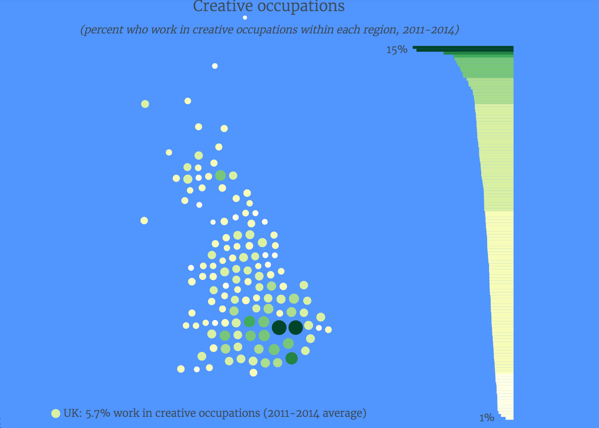</img>

你能喝多少酒
======================================================

[网站](http://flowingdata.com/2016/07/11/how-much-alcohol-americans-drink/)

</img>

2014年的美国职业收入
======================================================

[网站](http://flowingdata.com/2016/06/28/distributions-of-annual-income/)

</img>

死亡的原因
======================================================

[网站](http://flowingdata.com/2016/01/05/causes-of-death/)

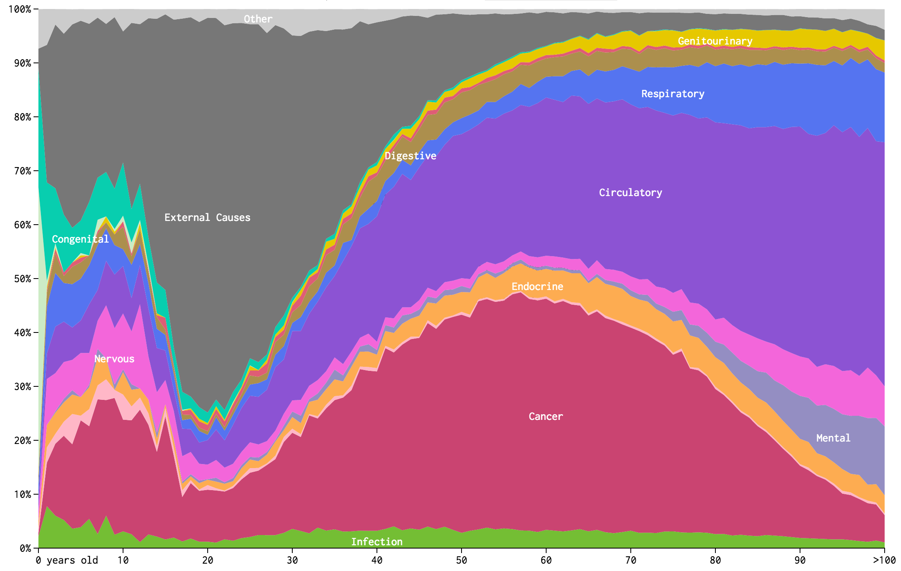</img>

你将如何死亡
======================================================

[网站](http://flowingdata.com/2016/01/19/how-you-will-die/)

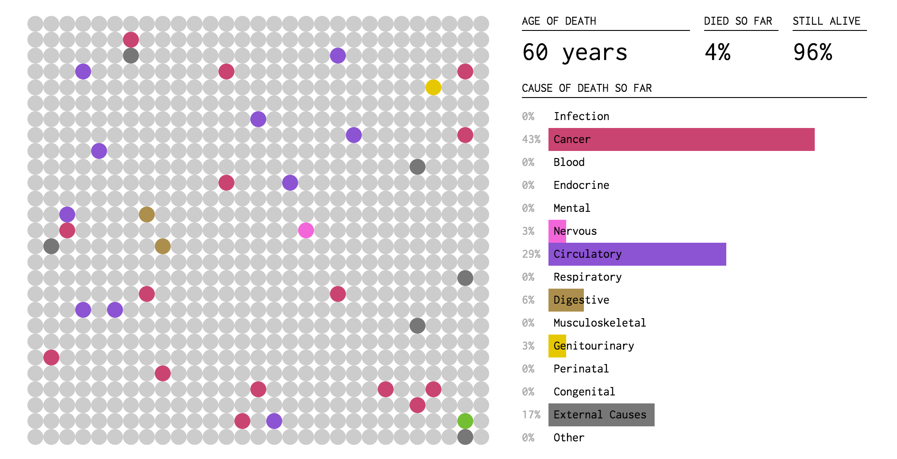</img>

你嫁（娶）给谁
======================================================

[网站](http://www.bloomberg.com/graphics/2016-who-marries-whom/)

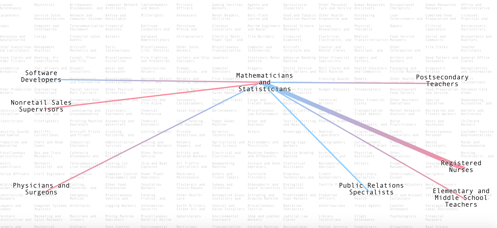</img>

单身
======================================================

[网站](http://flowingdata.com/2016/03/10/never-been-married/)

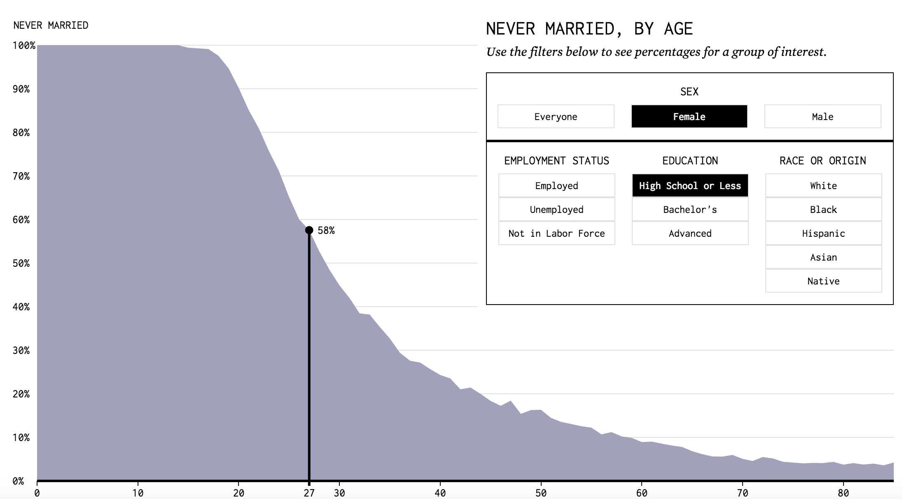</img>

美国民族分布
======================================================

[网站](http://flowingdata.com/2015/05/04/map-of-most-common-race/)

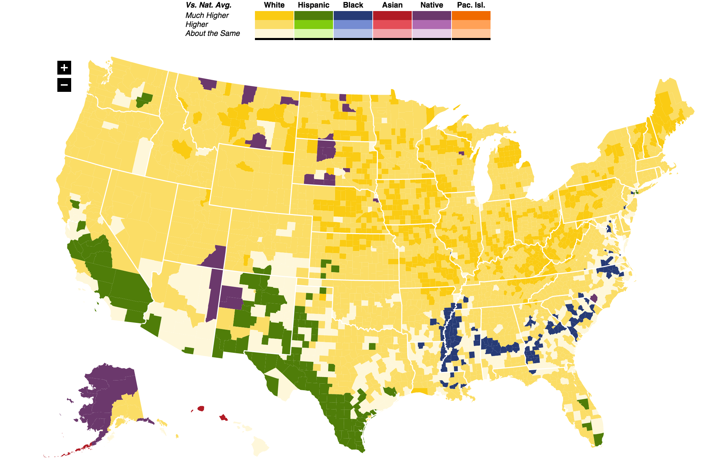</img>

世界移民状态
======================================================

[网站](http://charts.animateddata.co.uk/worldmigration/)

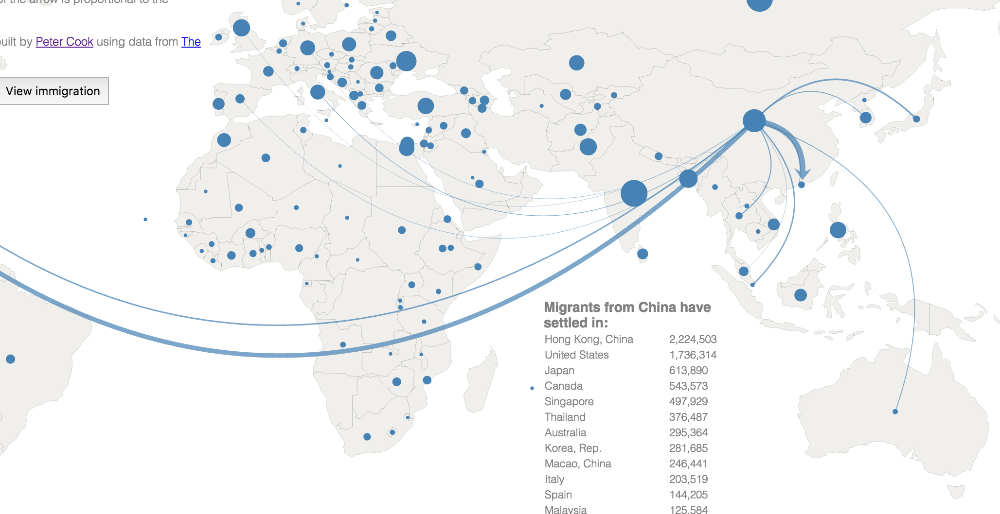</img>

著名创作者的日常安排
===============================================

[网站](https://podio.com/site/creative-routines)

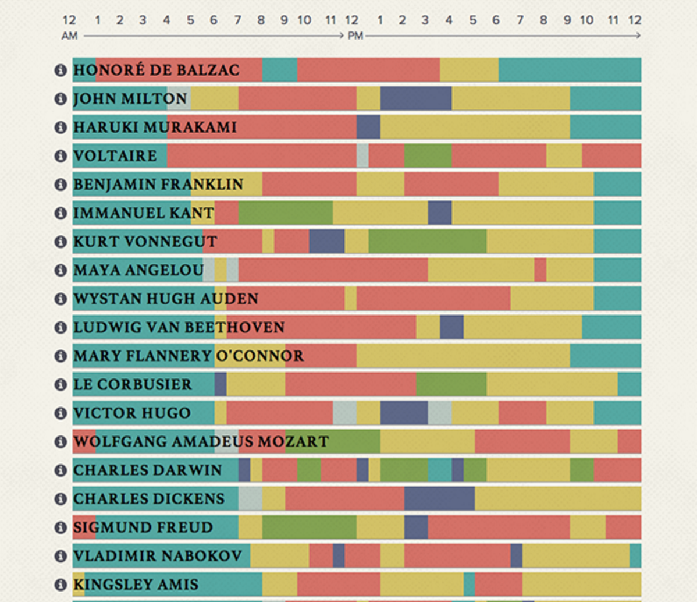</img>

2016温布尔登网球锦标赛
===============================================

<iframe src="http://charts.animateddata.co.uk/wimbledon/2016/matchtree/mens/" style="border:1px solid #e1e8ed;width:120%;height:560px;"></iframe>

什么让我们快乐？
===============================================

[网站](http://charts.animateddata.co.uk/whatmakesushappy/)

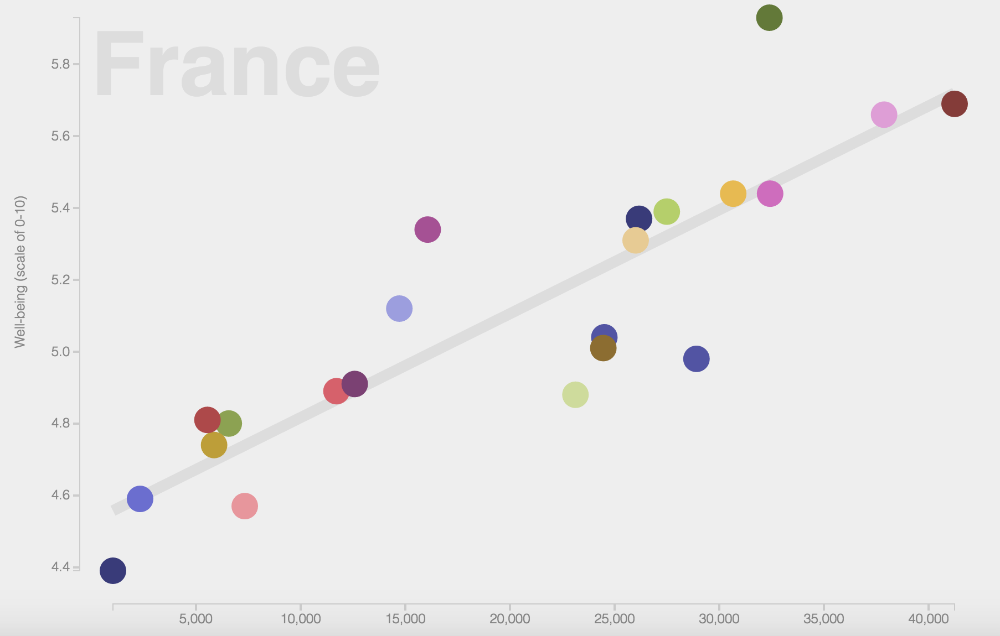</img>

图解机器学习
===============================================

[网站](http://www.r2d3.us/%E5%9C%96%E8%A7%A3%E6%A9%9F%E5%99%A8%E5%AD%B8%E7%BF%92%E7%AC%AC%E4%B8%80%E7%AB%A0/)

</img>

神经网络和深度学习怎样工作
=================================================
        
[网站](http://playground.tensorflow.org/#activation=tanh&batchSize=10&dataset=circle&regDataset=reg-plane&learningRate=0.03&regularizationRate=0&noise=0&networkShape=4,2&seed=0.65840&showTestData=false&discretize=false&percTrainData=50&x=true&y=true&xTimesY=true&xSquared=false&ySquared=false&cosX=false&sinX=false&cosY=false&sinY=false&collectStats=true&problem=classification&initZero=false)

</img>
        

普惠零首付逾期分布
==================================================

<!-- GeoChart generated in R 3.2.3 by googleVis 0.5.10 package -->
<!-- Sun Jul 31 12:36:24 2016 -->

<!-- jsHeader -->

 
<!-- jsChart -->  

<!-- jsChart -->  

 
<table border="0">
<tr>
<td>

<!-- divChart -->
  

</td>
<td>

<!-- divChart -->
  

</td>
</tr>
</table>

Simpsons Paradox
====================================================

<iframe src="http://blog.vctr.me/posts/simpsons-paradox.html" style="border:1px solid #e1e8ed;width:120%;height:560px;"></iframe>

Reference
============================

* Atlas of Prejudice: [https://atlasofprejudice.com/](https://atlasofprejudice.com/)
* FlowingData: [http://flowingdata.com/about/](http://flowingdata.com/about/)
* TheUpShot: [http://www.nytimes.com/section/upshot](http://www.nytimes.com/section/upshot)
* D3: [https://d3js.org/](https://d3js.org/)
* Blog of Peter Cook: [http://animateddata.co.uk/](http://animateddata.co.uk/)
* Hans Rosling’s talks

Code References
========================================================

.Rpres Code in my github repository
https://github.com/laoshen22/visualization

rCharts
http://ramnathv.github.io/rCharts/

googleVis
https://code.google.com/p/google-motion-charts-with-r/

Flash Settings for Motion Chart
http://www.macromedia.com/support/documentation/en/flashplayer/help/settings_manager04.html

